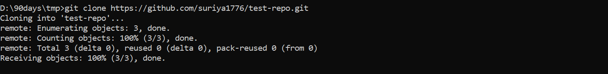
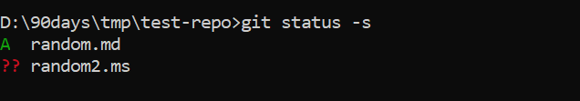
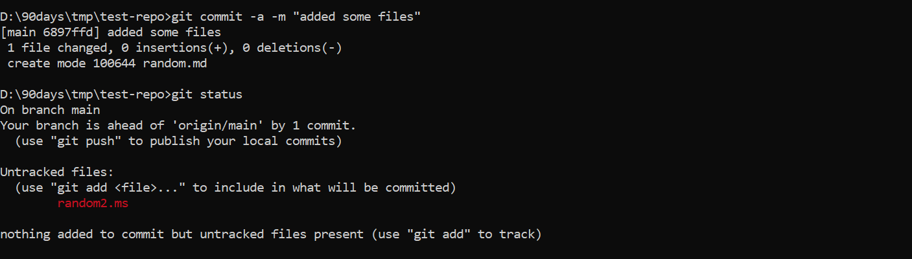
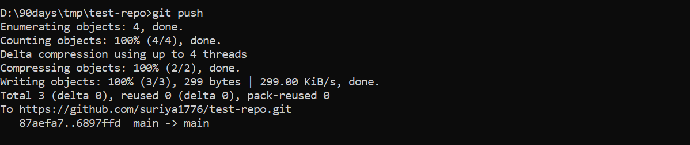
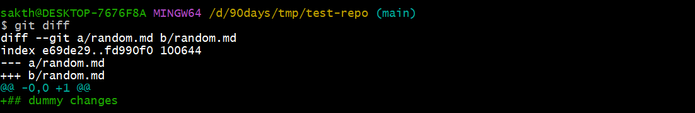

# Clone the repository and basic operations

## Clone the repo

- Use clone command to clone the repository locally 



- Add the code files to repo directory  and save the changes before adding the file it will tracked by git 

- Move the file to be pushed to remote repo using command

```sh
git add <file name to be moved>
```
- This command moves the files to staging area


## Check status

- we can check the status of the files in git local repo by command

```sh
git status -s
```

- The -s (or --short) option in git status -s stands for short format. It provides a more compact and concise output



### **Explanation of Symbols**

|Symbol|Meaning|
|---|---|
|`M`|Modified file|
|`A`|Added file (staged for commit)|
|`D`|Deleted file|
|`??`|Untracked file (not in Git yet)|
|`UU`|Unmerged file (conflict)|

## Commiting the file 

- Create a new commit using command 

```sh
git commit  -a -m "Added some files"
```

- -a / --all - tells git automatically stage all tracked files , the files which are not added or untracked files are not commited here

- -m - Commit message

### **What Happens Internally?**

- Git first checks for **tracked files** that have been **modified or deleted**.
- It stages them automatically.
- It then creates a commit, saving the changes along with the commit message.



- From the pic , you could see the untracked file is not moved to the staging area


## Pushing the changes

- command used to push the changes to the remote repo, it pushed the current branch 

```sh
git push
```



1. Configuring Git User Information

- **Purpose**: This configures Alice’s Git identity globally on her system.
- **Effect**: Every commit Alice makes will include this name and email.
- **Stored in**: `~/.gitconfig` file.

```sh
git config --global user.name "suriya"
git config --global user.email "suriya@gmail.com"
```

##  Reviewing the changes

- You are doing some changes in a file , to check the status of the files changes before adding and commiting , use command

```sh
git diff
```



