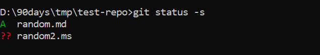

# Clone the repository and basic operations

## Clone the repo

- Use clone command to clone the repository locally 


- Add the code files to repo directory  and save the changes before adding the file it will tracked by git 

- Move the file to be pushed to remote repo using command

```sh
git add <file name to be moved>
```
- This command moves the files to staging area


## Check status

- we can check the status of the files in git local repo by command

```sh
git status -s
```

- The -s (or --short) option in git status -s stands for short format. It provides a more compact and concise output



### **Explanation of Symbols**

|Symbol|Meaning|
|---|---|
|`M`|Modified file|
|`A`|Added file (staged for commit)|
|`D`|Deleted file|
|`??`|Untracked file (not in Git yet)|
|`UU`|Unmerged file (conflict)|


