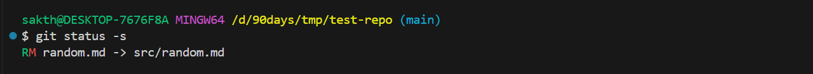

# Repo basics

## Moving and Renaming files

```sh
sakth@DESKTOP-7676F8A MINGW64 /d/90days/tmp/test-repo (main)
$ mkdir src

sakth@DESKTOP-7676F8A MINGW64 /d/90days/tmp/test-repo (main)
$ git mv random.md src/
```

- Commands are equivalent too

```sh
mv random.md src/
git rm random.md
git add src/random.md
```

- Verifying the change



- Then commit and then push the changes

- If there are confilicts , pull the code first and then push the changes done.

