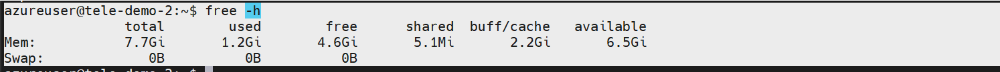
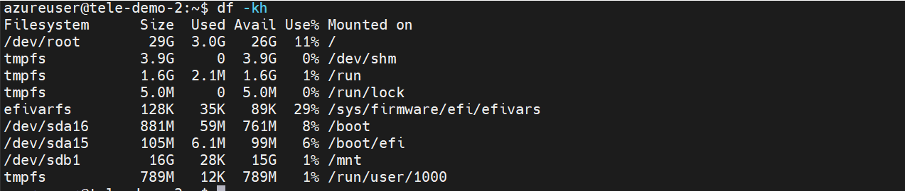
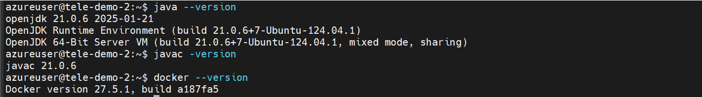
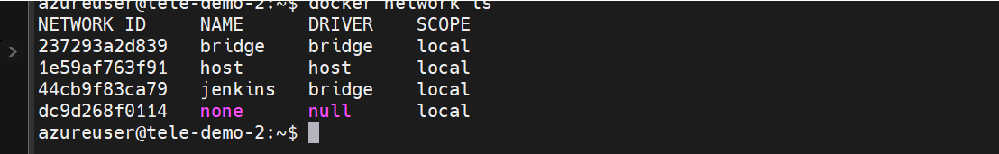
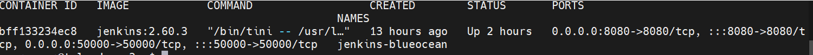
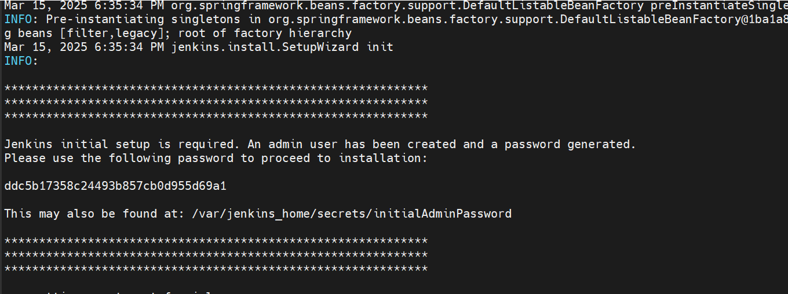
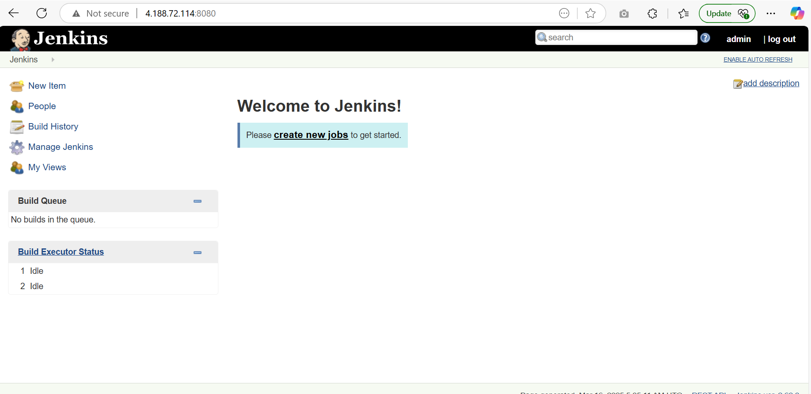

# Installation of jenkins in docker 

## Prerequisites

- A machine with 256 MB of RAM, although more than 2 GB is recommended
- A machine with 10 GB of drive space (for Jenkins and your Docker image)





- Java 17 or 21
- Docker 



## Installation

Creating a jenkins bridge

```sh
docker network create jenkins
```

Verify the creation by command

```sh
docker network ls
```



### Start command

```sh
docker run --name jenkins-container --restart=on-failure --detach --network jenkins --env DOCKER_HOST=tcp://docker:2376 --env DOCKER_CERT_PATH=/certs/client --env DOCKER_TLS_VERIFY=1 --publish 8080:8080 --publish 50000:50000 --volume jenkins-data:/var/jenkins_home --volume jenkins-docker-certs:/certs/client:ro jenkins:<replace the latest tag>
```

- Replace the Image tag with latest tag version from docker hub

- Container will be started in the background



- Follow the logs and get the admin password of jenkins



- Login from the browser, jenkins is exposed in 8080 port

