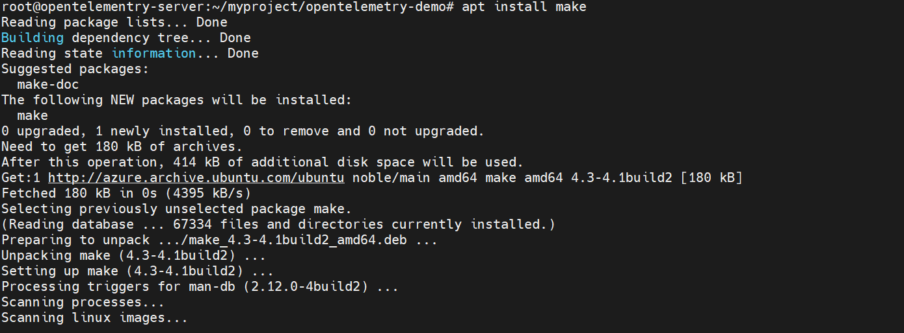
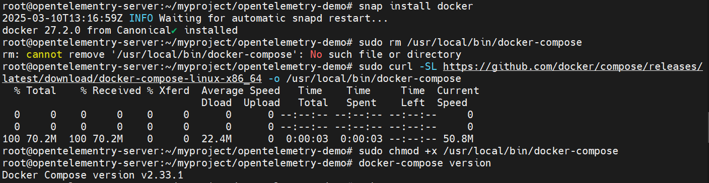
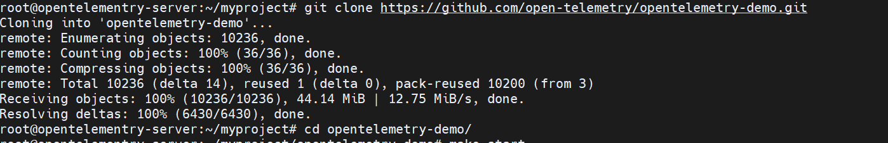
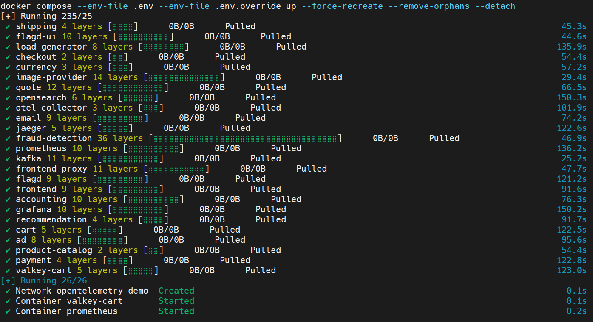
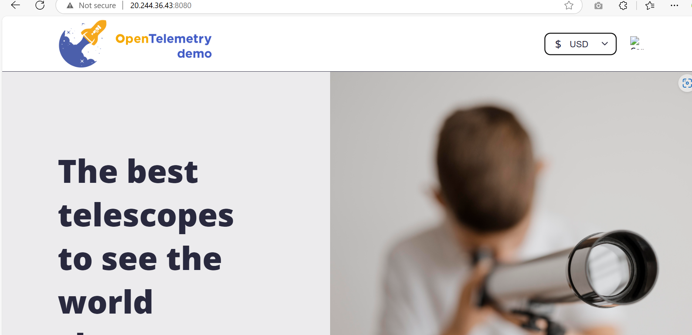
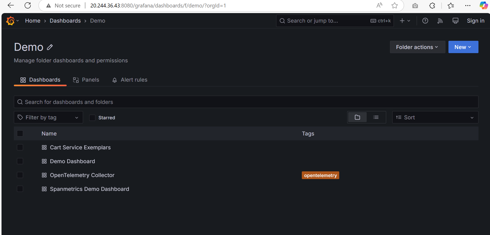

# Deploying the Opentelemetry App As per documentation

This guide explains how to install and run OpenTelemetry components using Docker Compose, following the official documentation. This setup is intended for demonstration and learning purposes.

## Table of Contents
1. [Prerequisites](#prerequisites)
2. [Installing the App](#installing-the-app)
3. [Accessing from Browser](#accessing-from-browser)


## Prerequisites

Before you begin, make sure you have the necessary tools installed on your Ubuntu system.

### 1. Install Make
Make is a build automation tool required for some build processes. Install it using:
```sh
sudo apt install make
```


### 2. Install Docker
devops-assets\opentelemetry
```sh
sudo snap install docker
```

### 3. Installation Steps for Docker Compose
 - 1. Download the Latest Docker Compose Binary

 ```sh
 sudo curl -SL https://github.com/docker/compose/releases/latest/download/docker-compose-linux-x86_64 -o /usr/local/bin/docker-compose
 ```

 - 2. Set Executable Permissions

 ```sh
 sudo chmod +x /usr/local/bin/docker-compose
 ```

 - 3. Verify the Installation

```sh
docker-compose version
```



## Installing the App

1. **Clone the Repository:**
```sh
git clone https://github.com/open-telemetry/opentelemetry-demo.git
cd opentelemetry-demo/
```



2. **Start demo:**
```sh
make start
```
Command will run docker compose file and create all the container of the application


## Accessing from Browser

Hit the urls from the browser, replace the localhost with the respective IP , if it is hosted

```sh
Web store: http://localhost:8080/
Grafana: http://localhost:8080/grafana/
Load Generator UI: http://localhost:8080/loadgen/
Jaeger UI: http://localhost:8080/jaeger/ui/
Tracetest UI: http://localhost:11633/, only when using make run-tracetesting
Flagd configurator UI: http://localhost:8080/feature
```





