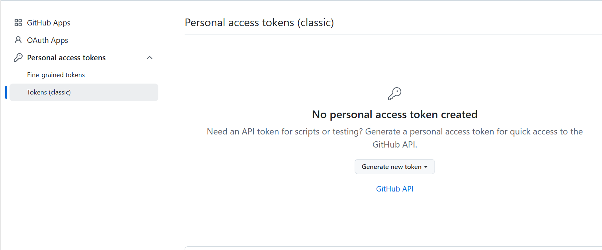
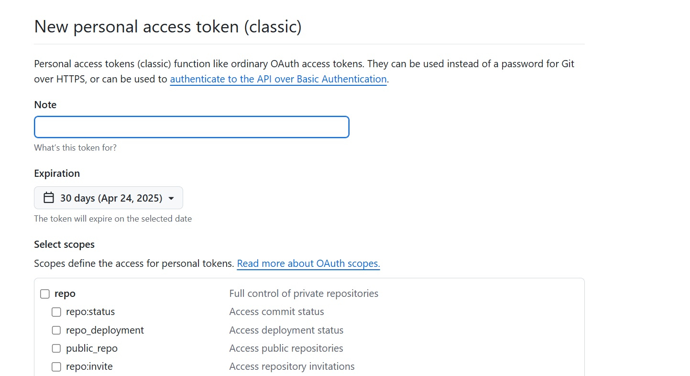
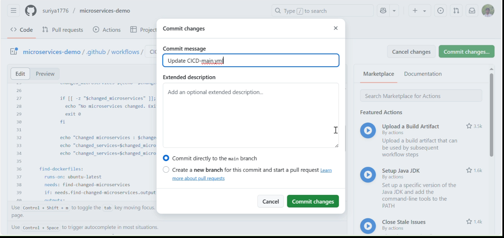
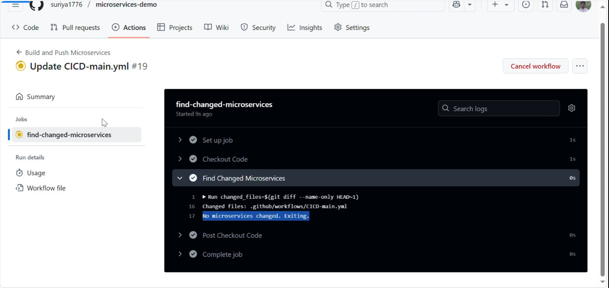
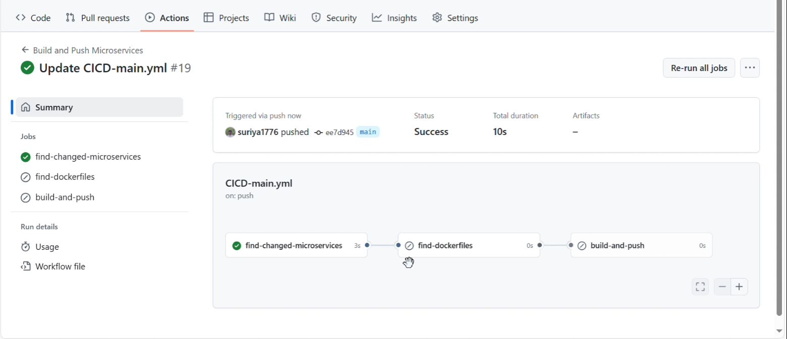
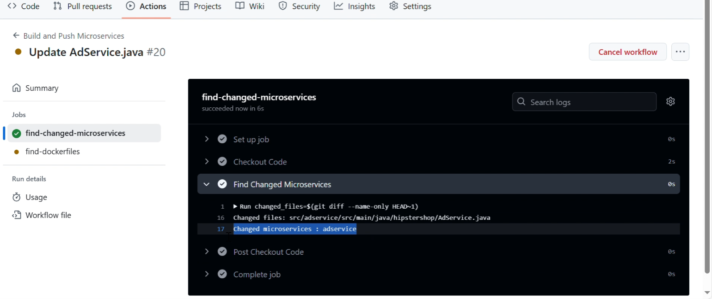
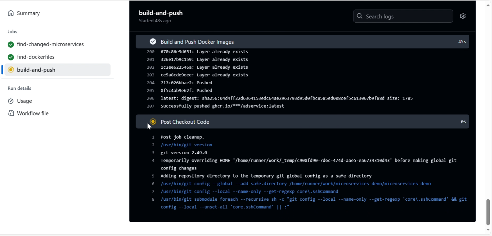
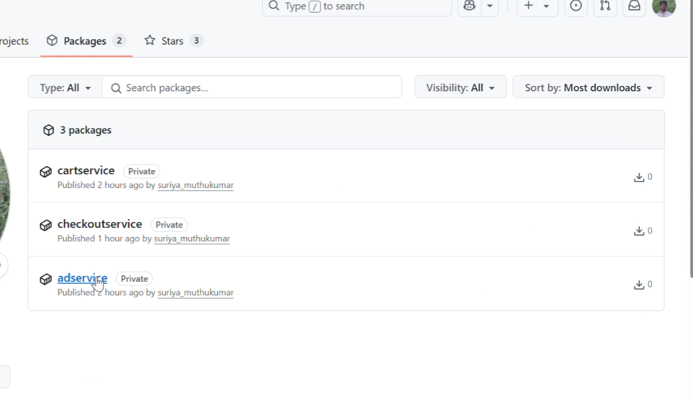

# Configuring CICD with github actions

### Creating personal access token for github actions

- Navigate to settings -> Developer settings -> Personal access token

- Click on tokens(classic) and click on generate new token

- Give token a name , check in write packages and generate the token
- This token can be used to login , write and read from github Image registry

### Github actions workflows

All workflows should be present in path /.github/workflows/<workflowname.yml>, github scans workflow in this path and run it based on the conditions present 

- I have created a workflow in the SCM repo named CICD-main.yml

- Where ever there is push operation or pull request merged to them main , the workflow is executed 

- If the changes done to specific microservice , only that microservice is built and pushed to GHCR , If not the Image building part is skipped

- For authenticating GHRC registry , username and password is configured as the secrets in the repo.

### CICD operation

- I am changing the workflow file and pushing to master 

- Since this is dummy push , you can see no microservice is detected and Image build stage is skipped

- I am making the change in one of the microservices folder , Now Image is builded and pushed to GHRC registry

