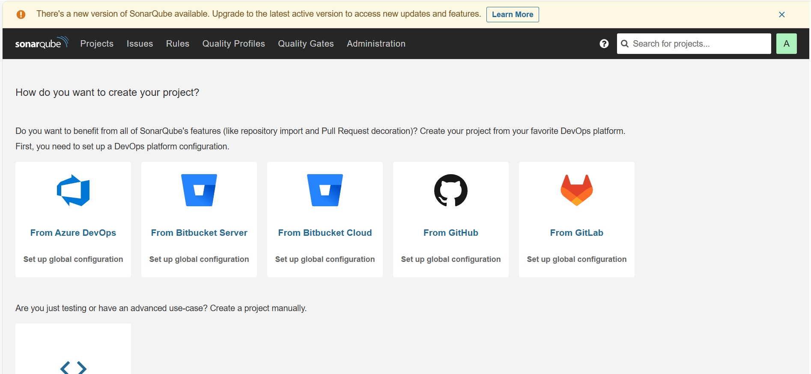
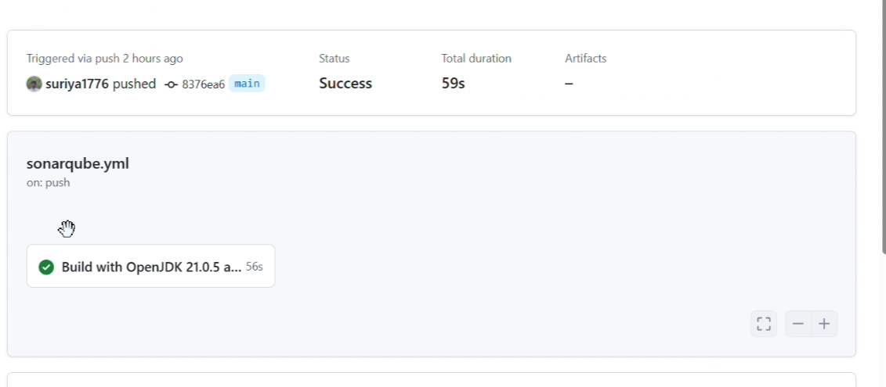
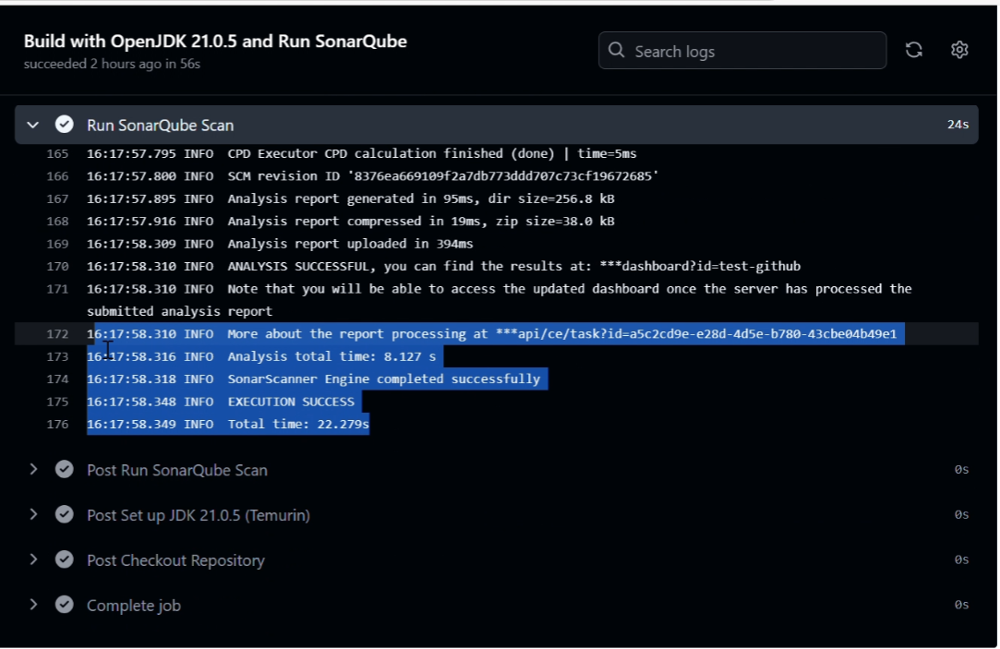
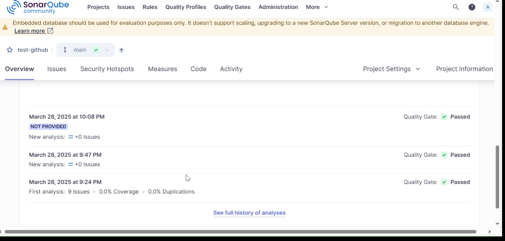

# 🛠️ Static Code Scanning Using SonarQube  

## 📌 Installing SonarQube in a VM  

### 1️⃣ Setting Up SonarQube with Docker Compose  

- Create a **`docker-compose.yml`** file and paste the following configuration:  

```yaml
version: '3'
services:
  postgres:
    image: postgres:13
    container_name: postgres
    environment:
      POSTGRES_USER: sonar
      POSTGRES_PASSWORD: sonar
      POSTGRES_DB: sonarqube
    ports:
      - "5432:5432"

  sonarqube:
    image: sonarqube:community
    container_name: sonarqube
    depends_on:
      - postgres
    environment:
      SONARQUBE_JDBC_URL: "jdbc:postgresql://postgres/sonarqube"
      SONARQUBE_JDBC_USERNAME: sonar
      SONARQUBE_JDBC_PASSWORD: sonar
    ports:
      - "9000:9000"

```

### 2️⃣ Running SonarQube

- Execute the following command to start the SonarQube and PostgreSQL containers:
    

```sh
docker-compose up
```


- This will bring up **PostgreSQL** and **SonarQube** containers.
    

### 3️⃣ Accessing SonarQube

- Open your browser and navigate to **`http://<VM-IP>:9000`**
    
- Log in using the **default credentials** (`admin` / `admin`).
    
- **🔒 Reset your password** upon the first login.
    
    
    

---

## 📌 Configuring a Project in SonarQube

### 4️⃣ Creating a New Project

- **🆕 Manually create a new project** in SonarQube.
    
- **🔑 Generate a token** for authentication.
    
- **📝 Enter the project key** during setup.
    

### 5️⃣ Configuring Sonar Scanner

- Create a **`sonar-project.properties`** file and add the following configuration:
    


```sh
sonar.projectKey=test-github sonar.java.binaries=build/`
```

---

## 📌 Running Static Code Analysis

- Once the **GitHub Actions workflow** is executed, SonarQube will analyze the repository.
    
- The **📊 issues and reports** will be generated in the SonarQube project.
    
      
      
    
    

This setup ensures **automated static code analysis** 🛡️ using SonarQube, helping maintain **code quality and security** 🚀.