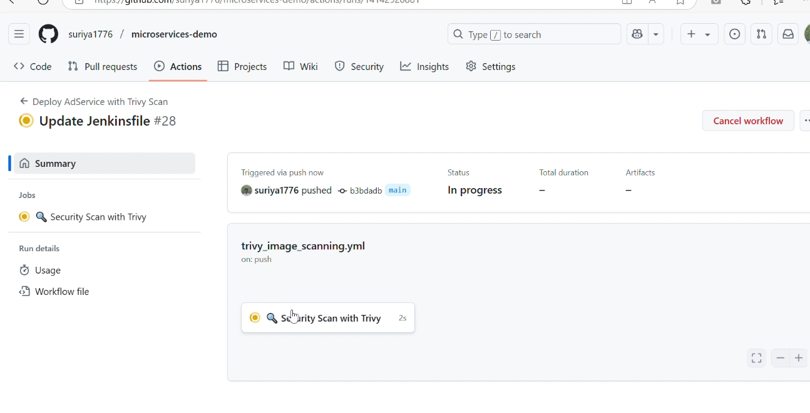
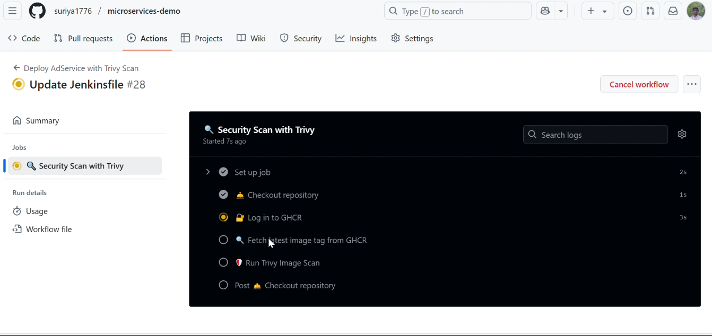
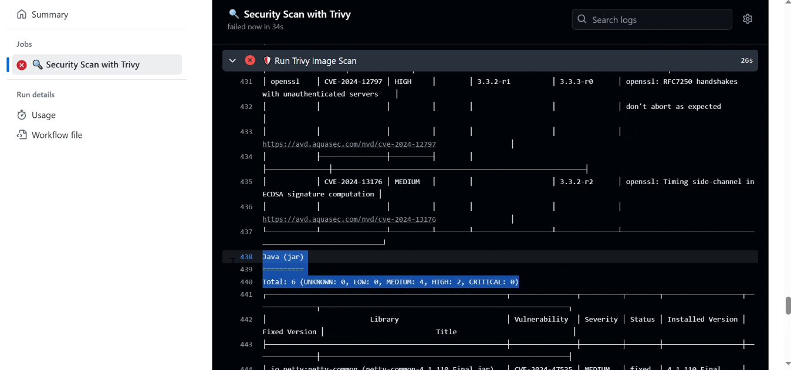

# 🛡️ Image Scanning Using Trivy  

**Trivy** is a fast, simple, and comprehensive security scanner for **containers, Kubernetes, and system components**. Developed by **Aqua Security**, it helps identify **vulnerabilities, misconfigurations, and secrets** in code and infrastructure.  

---

## 🔄 Automated Image Scanning with GitHub Actions  

- A **GitHub Actions workflow** is set up to **run daily** using a **cron job** for **image scanning**.  
- **No additional configuration** is required—**GitHub runners** handle the scanning process.  

### 📄 [Trivy Workflow File](https://github.com/suriya1776/microservices-demo/blob/main/.github/workflows/trivy_image_scanning.yml)  

---

## 📌 Workflow Execution  

- The scanning process is automatically triggered based on the **defined schedule**.  
- **Results are displayed in GitHub Actions logs** after execution.  

### 📸 Workflow Execution Screenshots  

✅ **Trivy Workflow Running**  
  

✅ **Pipeline Execution Status**  
  

✅ **Trivy Scan Output**  
  

---

This setup ensures **continuous security scanning** 🛠️, helping to **detect and mitigate vulnerabilities** in container images 🚀.
