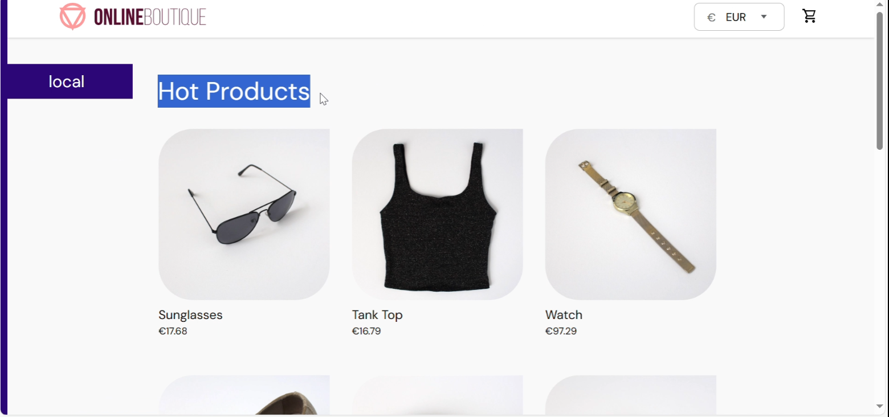
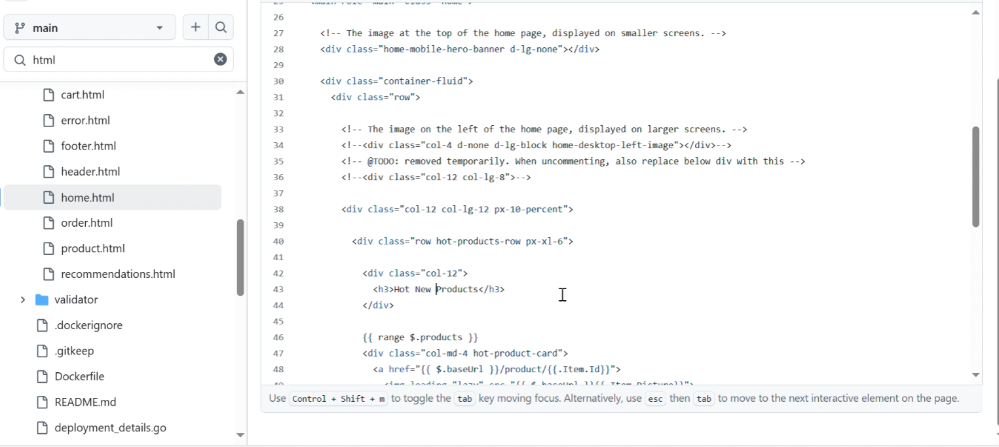
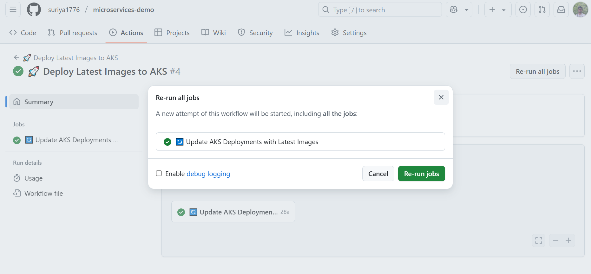
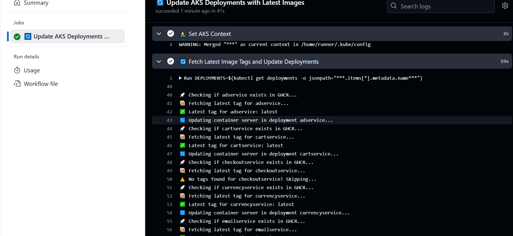
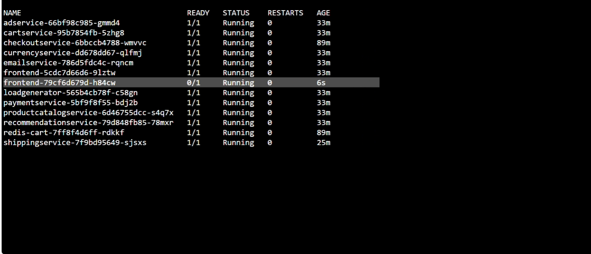
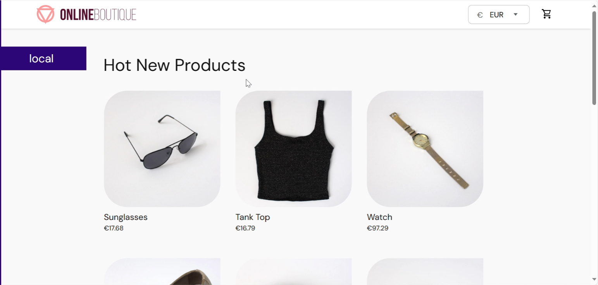

# 🚀 Deployment in AKS Cluster  

## 🔧 Create an Azure AKS Cluster Using Terraform  

📂 **[Source File](tech_asset/azure_aks.tf)**  

---

## 📜 AKS Cluster Details  

- Retrieve **Subscription ID, Resource Group, and Cluster Name** using the following commands:  

```sh
az account show --query id --output tsv
az aks list --query '[].{name:name,resourceGroup:resourceGroup}' --output table
```

- Execute the following command in a terminal where Azure CLI is installed and connected to your cluster. This command creates an RBAC role for GitHub Actions:


```sh
az ad sp create-for-rbac --name "github-actions-aks" --sdk-auth --role contributor \
    --scopes /subscriptions/<sub ID>/resourceGroups/<Resource group name>/providers/Microsoft.ContainerService/managedClusters/<Cluster name>

```
- This command returns a JSON response. Save this information securely, as it will be used to connect to the Azure cluster:

```sh
{
  "clientId": "21dd61ba-90ea-42aa-8e70-8a52bb31",
  "clientSecret": "~CY8Q~TuJIICvLWlIp~-W9z1KZtNcLa.qauB",
  "subscriptionId": "4d19167d-fe08-4336-8c1f-ef2ddc6",
  "tenantId": "5f95ae70-3df4-4b27-95cb-f04315597",
  "activeDirectoryEndpointUrl": "https://login.microsoftonline.com",
  "resourceManagerEndpointUrl": "https://management.azure.com/",
  "activeDirectoryGraphResourceId": "https://graph.windows.net/",
  "sqlManagementEndpointUrl": "https://management.core.windows.net:8443/",
  "galleryEndpointUrl": "https://gallery.azure.com/",
  "managementEndpointUrl": "https://management.core.windows.net/"
}
```

## 🔑 Configuring GitHub Actions Workflow

- Create a **GitHub secret** for the following values:
    
    - `AKS_CLUSTER_NAME`
        
    - `AZURE_CREDENTIALS`
        
    - `AZURE_RESOURCE_GROUP`
        

📄 **[Workflow File](https://github.com/suriya1776/microservices-demo/blob/47352e256e3e9aca5fd9950380f8ad5da091b876/.github/workflows/aks_deployment.yml)**

---

## 📌 Automated Deployment Process

- The workflow **runs daily** and can also be **triggered manually**.
    
- It **detects the latest image** pushed to the registry and **deploys it to the AKS cluster**.
    

---

### 📸 Demonstration

✅ **Before Change:**

- The UI **header text** displays **"Hot product"**.
    



✅ **Applying Changes:**

- Updating the **HTML code** to **"Hot new products"**.
    



✅ **Image Build and Deployment Triggered:**

  


✅ **Pod Deployment and UI Verification:**

- The **frontend pod** is deployed with the **latest image change**.
    
- The **change is reflected in the UI**.
    

  


---

🔹 **This setup enables continuous deployment to AKS**, ensuring that the latest changes are **automatically deployed and updated** in the cluster! 🚀