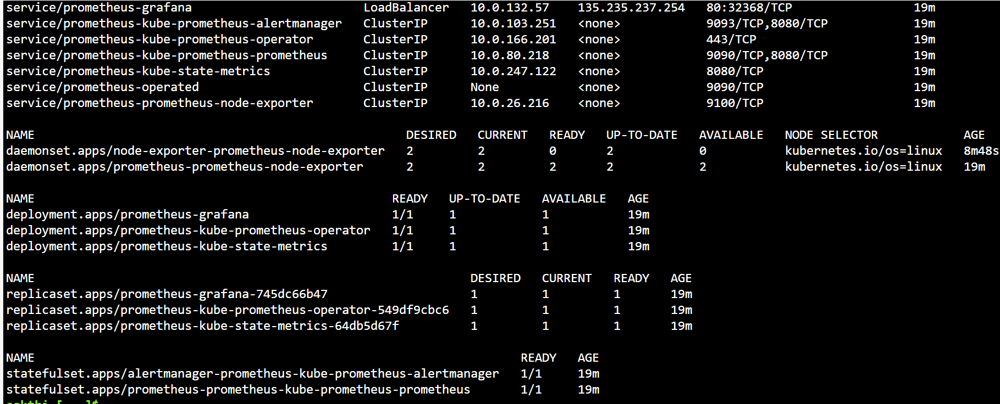
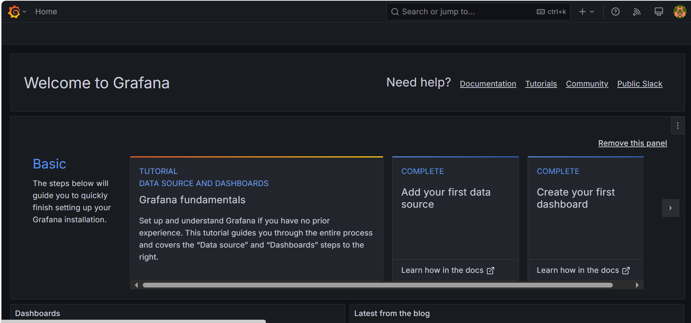
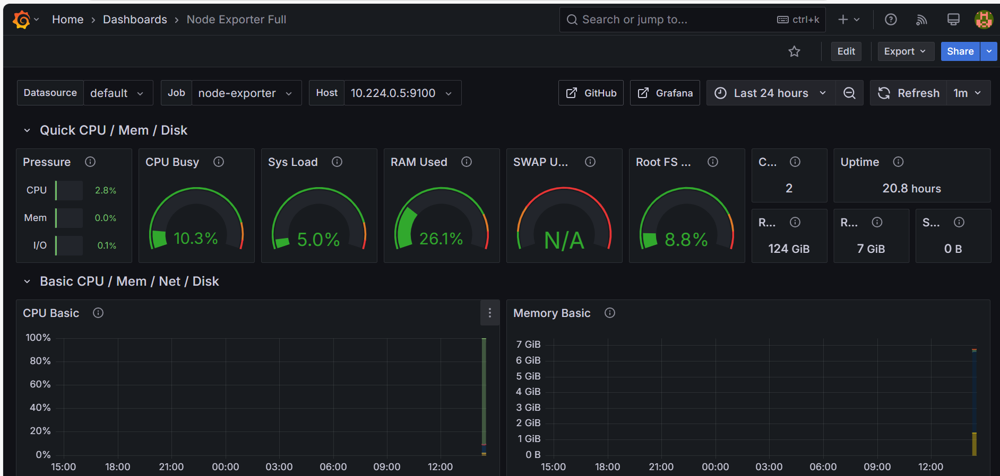

# Monitoring using prometheus and grafana

Deployed Prometheus and Grafana in an Azure Kubernetes Service (AKS) cluster using Helm to monitor cluster performance and workloads.

Configured Prometheus to scrape metrics from Kubernetes components (API Server, Node Exporter, Kubelet, and cAdvisor).

Integrated Grafana with Prometheus as a data source and created custom dashboards for real-time cluster monitoring, including node utilization, pod health, and application performance.

## Install prometheus and grafana using helm

- Create a namespace 

```bash
kubectl create ns monitoring
```

```bash
helm install prometheus prometheus-community/kube-prometheus-stack -n monitoring --set grafana.service.type=LoadBalancer
```

- All deployment are running , and grafana is exposed to internet





