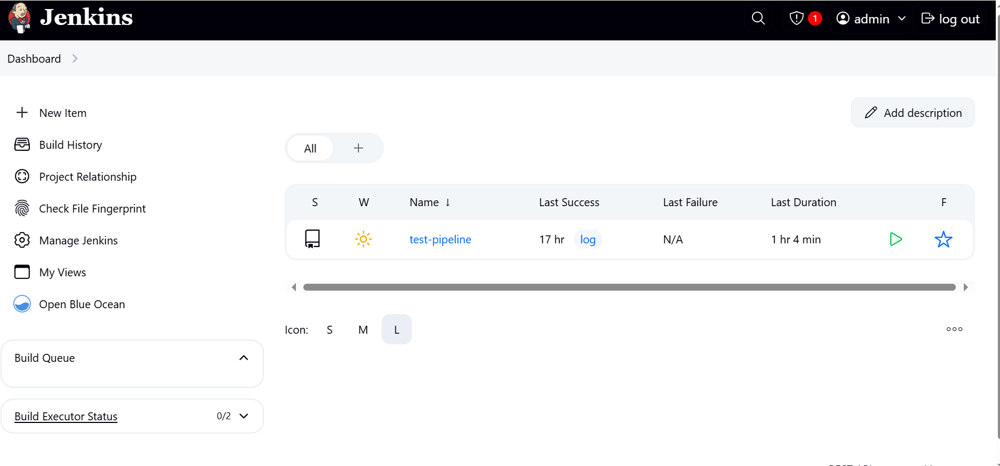
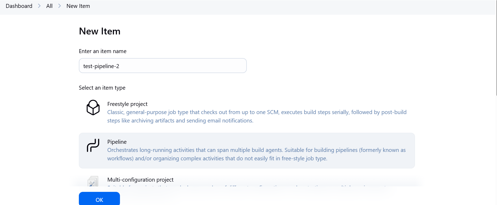
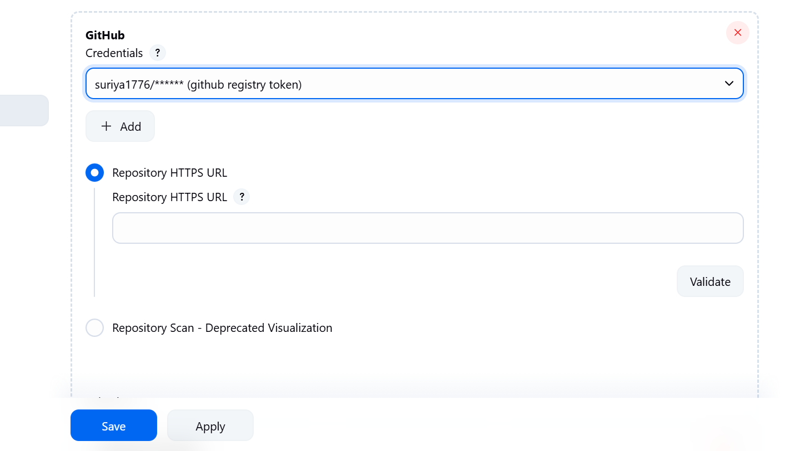
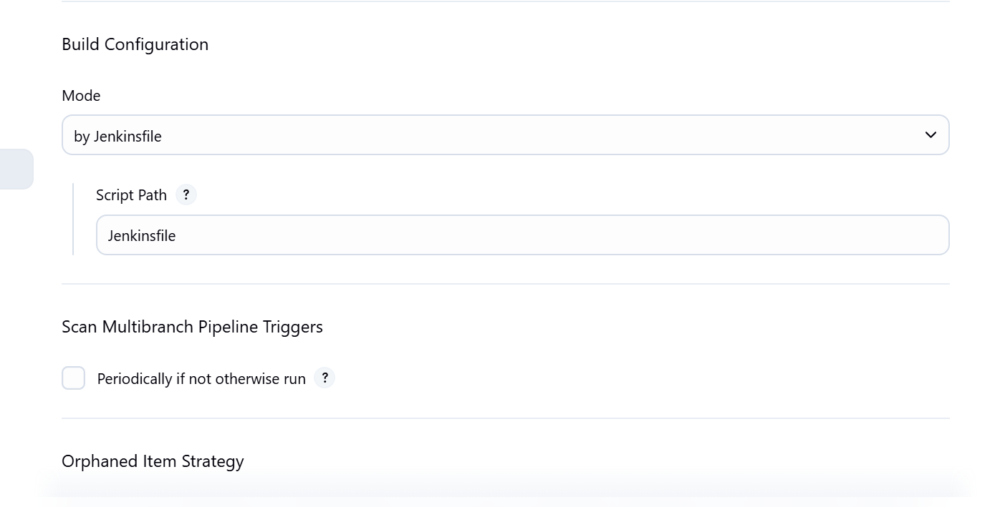
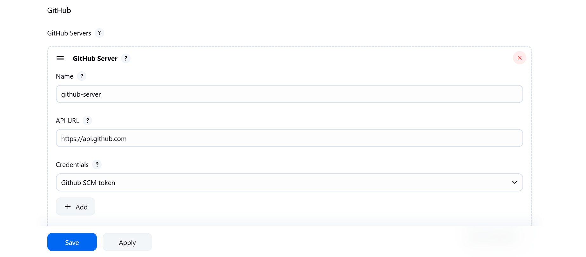
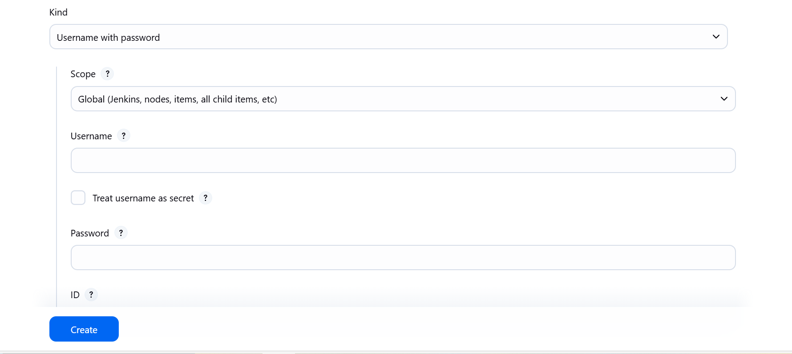
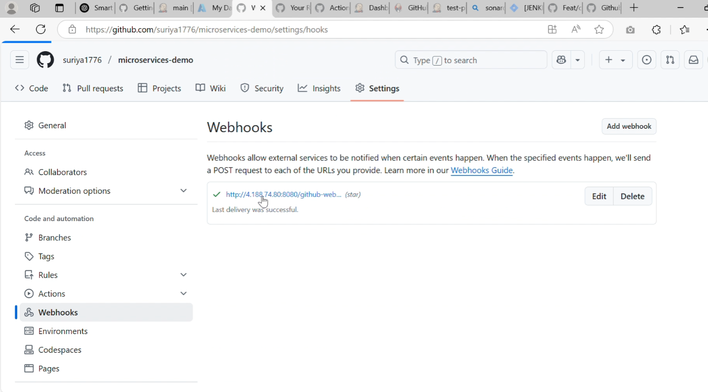
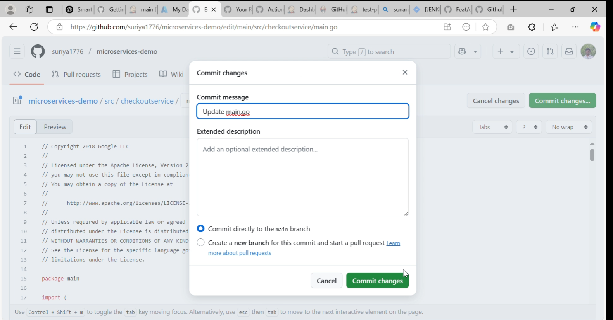
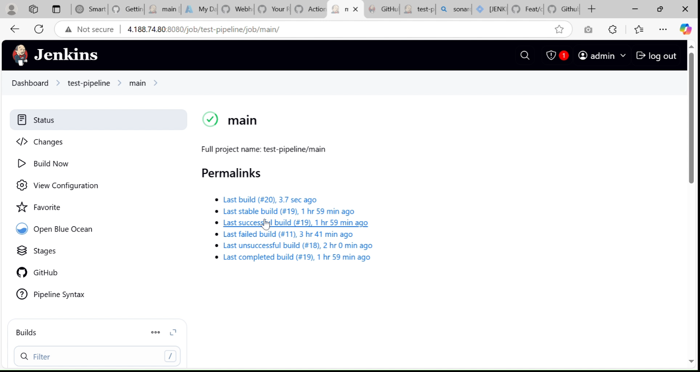
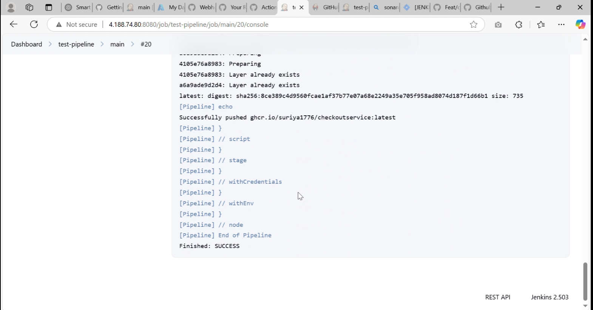

# CICD with jenkins

### Installing jenkins in VM machine

- Create a docker network

```sh
docker network create jenkins
```

- Start the docker dind container , which helps in building Images using jenkins

```sh
docker run --name jenkins-docker --rm --detach   --privileged --network jenkins --network-alias docker   --env DOCKER_TLS_CERTDIR=/certs   --volume jenkins-docker-certs:/certs/client   --volume jenkins-data:/var/jenkins_home   --publish 2376:2376   docker:dind --storage-driver overlay2cd
```

- Build a custom jenkins Image using the below Dockerfile

```sh
FROM  jenkins/jenkins:latest-jdk17
USER root
RUN apt-get update && apt-get install -y lsb-release ca-certificates curl && \
    install -m 0755 -d /etc/apt/keyrings && \
    curl -fsSL https://download.docker.com/linux/debian/gpg -o /etc/apt/keyrings/docker.asc && \
    chmod a+r /etc/apt/keyrings/docker.asc && \
    echo "deb [arch=$(dpkg --print-architecture) signed-by=/etc/apt/keyrings/docker.asc] \
    https://download.docker.com/linux/debian $(. /etc/os-release && echo \"$VERSION_CODENAME\") stable" \
    | tee /etc/apt/sources.list.d/docker.list > /dev/null && \
    apt-get update && apt-get install -y docker-ce-cli && \
    apt-get clean && rm -rf /var/lib/apt/lists/*
USER jenkins
RUN jenkins-plugin-cli --plugins "blueocean docker-workflow"
```

- Replace the FROM jenkins to the latest jenkins Image or the image you need 

```sh
docker build -t myjenkins-blueocean:2.492.2-1 .
docker run --name jenkins-blueocean --restart=on-failure --detach   --network jenkins --env DOCKER_HOST=tcp://docker:2376   --env DOCKER_CERT_PATH=/certs/client --env DOCKER_TLS_VERIFY=1   --publish 8080:8080 --publish 50000:50000   --volume jenkins-data:/var/jenkins_home   --volume jenkins-docker-certs:/certs/client:ro   myjenkins-blueocean:2.492.2-1
```

- This will bring up the docker container in port 8080

- Get the master password from the container logs



## Configuring CICD Job in jenkins

- Create a multistage pipeline



- Configure the pipeline , In branch source stage add the github repo details






### Configure a webhook

- Navigate to Manage jenkins -> System -> Github , add github server




- Make sure to check the manage hooks box, this will autoconfigure webhook in the SCM repo

### Configuring gobal credentials

- Navigate to Manage jenkins -> credentials -> System -> Global credentials -> Add credentials 



- Kind should secret text for access tokens , ID is the name of the credentials , this will be referenced in the jenkins config 

### Verfication of webhook in github UI

- Navigate to rep settings ->  webbooks , automatically a webhook will be triggered with jenkins url and the secrets



## CICD demo

- I am pushing changes to master branch




- Build is successfull and Image is pushed to ghrc


![Image status] ](assets/ss_11.png)