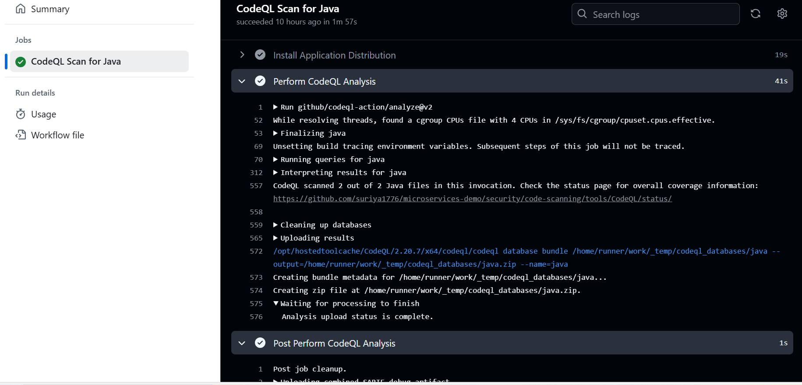

# 🛡️ Static Code Scan Using CodeQL

Through a scheduled GitHub Actions workflow (triggered by a cron job), a static code scan is performed on the repository to generate a security and code quality report.

### 📄 [GitHub Actions CODEQL Workflow](https://github.com/suriya1776/microservices-demo/blob/main/.github/workflows/codesql_scanning.yml)

### About CODEQL

CodeQL is a static analysis tool used in GitHub Actions to detect security vulnerabilities and code quality issues in your source code. It can identify issues such as SQL injection, buffer overflows, and hardcoded secrets before deployment. Whenever new code is pushed, the CodeQL scan is automatically initiated, ensuring continuous security monitoring.

