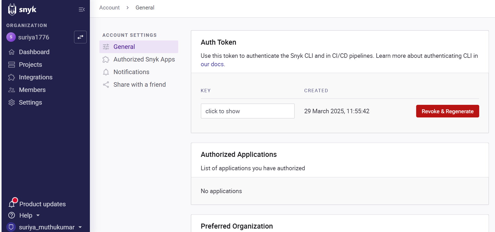
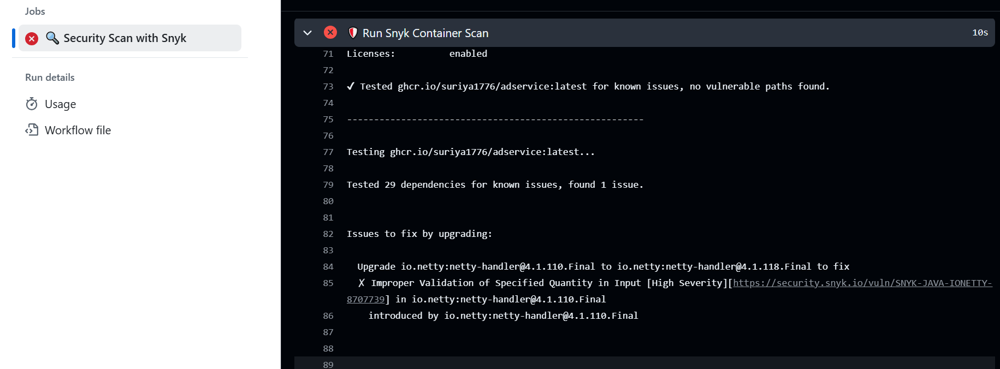
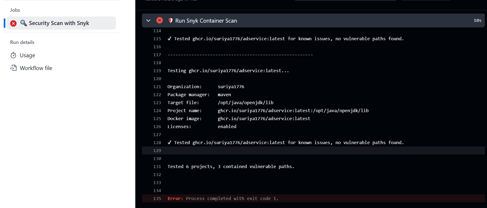

# Image scanning using snyk tool

Snyk is a security scanning tool designed to identify and fix vulnerabilities in code, dependencies, containers, and cloud infrastructure. It is widely used in DevSecOps workflows to integrate security into the development process.

- I have a github actions workflow file which will be triggered by cron job  for every day for Image scanning

### [Snyk worflow file](https://github.com/suriya1776/microservices-demo/blob/main/.github/workflows/snyk_scanning.yml)

## Configuring synk API token

- Create a account using google or github LDAP , login into snyk 

- Click on account name in bottom left , Account settings -> General , copy the API token

- Export the token as secret "SNYK_TOKEN"

## Execting the workflow

- As it is a cronjob , will be autotriggered for every day

- Since vulnerabilities detected the scanning failed , If there are no vulnerabilities , The pipeline will succeed