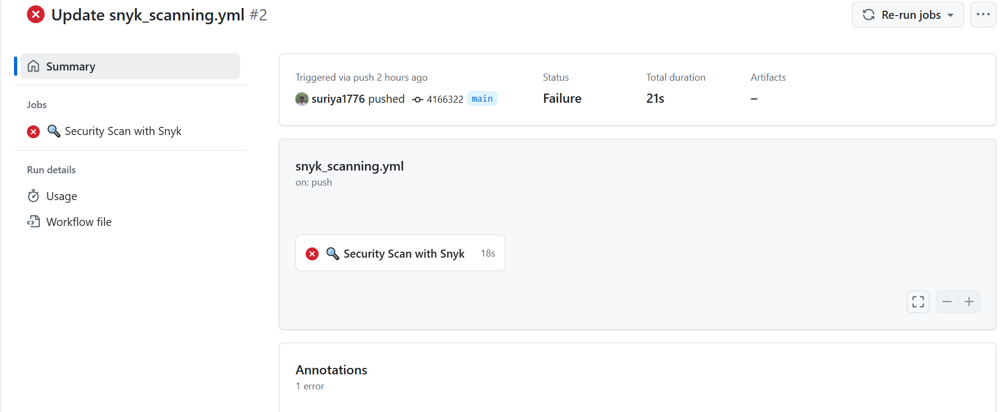

# Image scanning using Snyk tool

Snyk is a security scanning tool designed to identify and fix vulnerabilities in code, dependencies, containers, and cloud infrastructure. It is widely used in DevSecOps workflows to integrate security into the development process.

- I have a GitHub Actions workflow file which is triggered by a cron job every day for image scanning.

### [Snyk workflow file](https://github.com/suriya1776/microservices-demo/blob/main/.github/workflows/snyk_scanning.yml)

## Configuring Snyk API token

- Create an account using Google or GitHub LDAP and log into Snyk.
- Click on your account name in the bottom left, then navigate to **Account settings → General** and copy the API token.

- Export the token as a secret named **SNYK_TOKEN**.

## Executing the workflow

- As it is a cron job, it will be auto-triggered every day.

- If vulnerabilities are detected, the scanning will fail. If no vulnerabilities are found, the pipeline will succeed.
