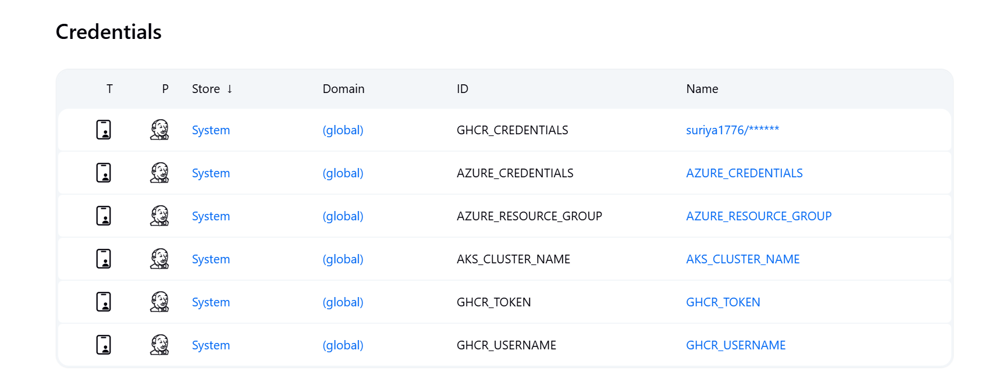
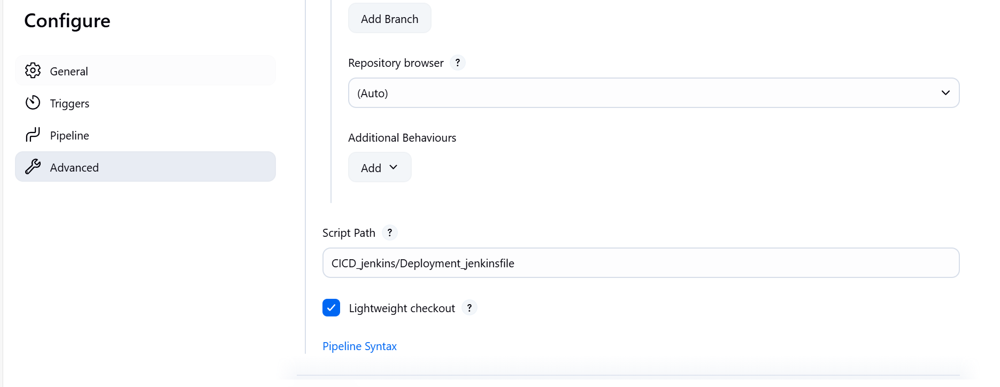
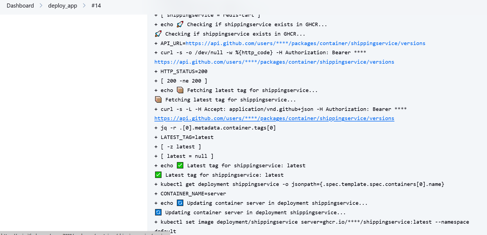
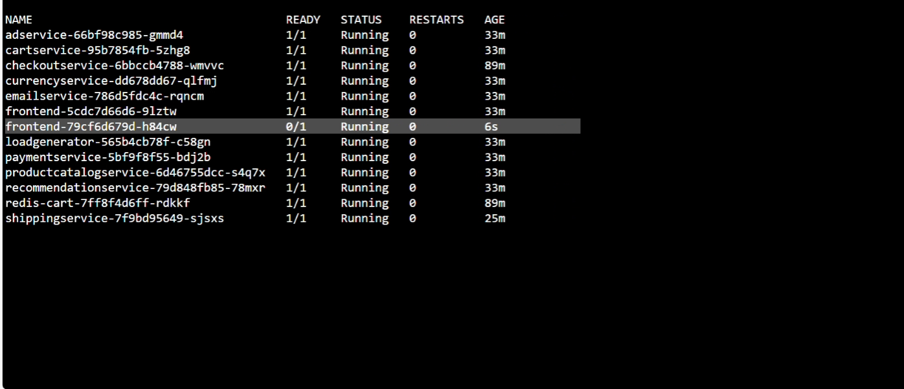

# Deployment in AKS cluster

### Create a Azure AKS cluster using terraform

### [Source file](tech_asset/azure_aks.tf)

### AKS cluster details

- Get the subcription ID , resource group and cluster name 

```sh
az account show --query id --output tsv
az aks list --query '[].{name:name,resourceGroup:resourceGroup}' --output table
```

- Exceute the below command where azure cli is present and connected to you cluster, for creating a rbac

```sh
az ad sp create-for-rbac --name "github-actions-aks" --sdk-auth --role contributor \
    --scopes /subscriptions/<sub ID>/resourceGroups/<Resource group name>/providers/Microsoft.ContainerService/managedClusters/<Cluster name>
```

- Will get the json responce , copy the response somewhere safe , those will be used as credentials to connect to the azure cluster

```json
{
  "clientId": "21dd61ba-90ea-42aa-8e70-8a52bb31",
  "clientSecret": "~CY8Q~TuJIICvLWlIp~-W9z1KZtNcLa.qauB",
  "subscriptionId": "4d19167d-fe08-4336-8c1f-ef2ddc6",
  "tenantId": "5f95ae70-3df4-4b27-95cb-f04315597",
  "activeDirectoryEndpointUrl": "https://login.microsoftonline.com",
  "resourceManagerEndpointUrl": "https://management.azure.com/",
  "activeDirectoryGraphResourceId": "https://graph.windows.net/",
  "sqlManagementEndpointUrl": "https://management.core.windows.net:8443/",
  "galleryEndpointUrl": "https://gallery.azure.com/",
  "managementEndpointUrl": "https://management.core.windows.net/"
}
```

# Configure the credentials in jenkins

- Navigate to Manage jenkins -> Credentials ->  global credentials , add Cluster credentials and ghrc token and username



-  Create a pipeline project and configure SCM, and provide the jenkins file path from the SCM



- When the pipeline is triggered , It will fetch the latest GHRC Images from and deploy it in the AKS cluster



- Image deployed in cluster , changed reflected in the UI



