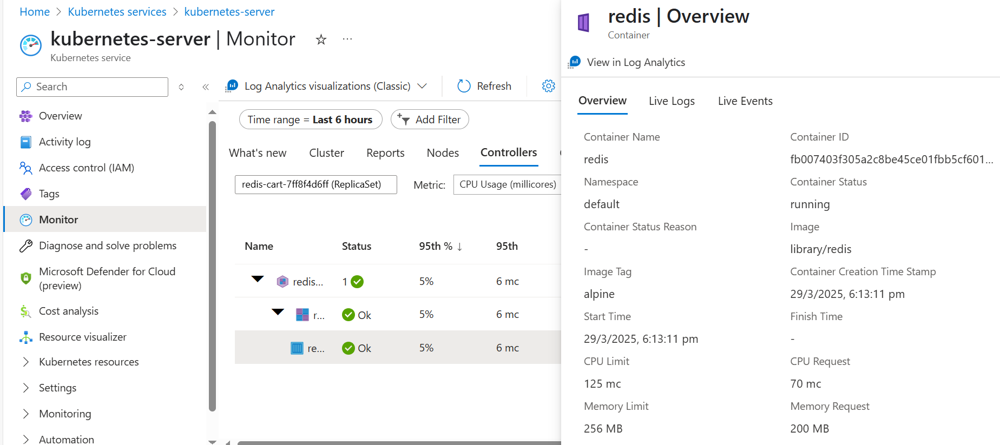

# Monitoring with Azure monitor

As already the application is deployed in azure aks , the inbuild monitor of cluster is available , to enable azure monitor follow the below steps

## ✅ Register the Provider

Run the following command to register the Microsoft.Insights provider for your subscription:

```sh
az provider register --namespace Microsoft.Insights
```

After that, check the registration status:

```sh
az provider show --namespace Microsoft.Insights --query registrationState
```
Once it shows "Registered", you can proceed with enabling monitoring:

```sh
az aks enable-addons --addons monitoring --resource-group azure-demo --name kubernetes-server
```


