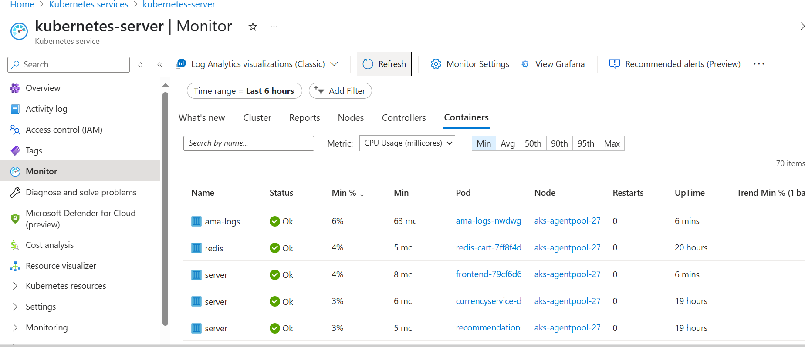

# 📊 Monitoring with Azure Monitor

Since the application is already deployed in **Azure AKS**, the **built-in cluster monitor** is available. Follow the steps below to enable **Azure Monitor** for AKS.

## ✅ Register the Provider

Run the following command to register the **Microsoft.Insights** provider for your subscription:

```sh
az provider register --namespace Microsoft.Insights
```

After that, check the registration status:

```bash
az provider show --namespace Microsoft.Insights --query registrationState
```

Once it shows "Registered", proceed with enabling monitoring:

```bash
az aks enable-addons --addons monitoring --resource-group azure-demo --name kubernetes-server
```


### 📌 Monitoring Enabled in Azure

