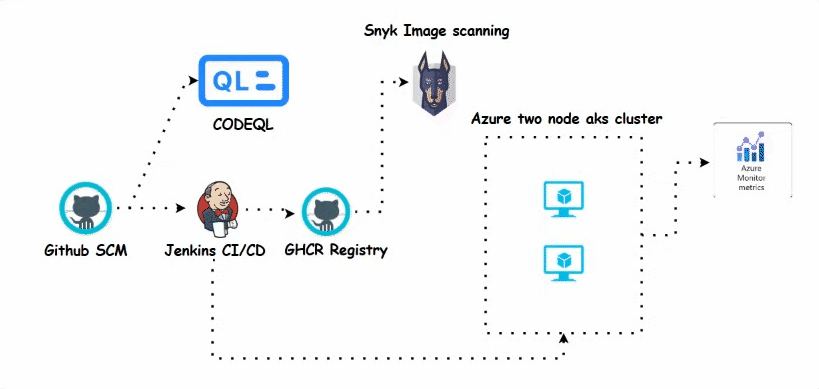

# 🚀 **CI/CD Pipeline with Jenkins, Azure AKS & Security Scanning**

## 🏗 **Project Overview**

This project implements an end-to-end **CI/CD pipeline** using **Jenkins**, **GitHub Actions**, and **Azure Kubernetes Service (AKS)** with integrated security and monitoring tools.

## 📌 **Architecture Workflow**

🔹 **GitHub SCM** - Hosts the source code repository.  
🔹 **GitHub Actions + Jenkins CI/CD** - Automates build, test, and deployment processes.  
🔹 **CodeQL** - Performs static code analysis for security vulnerabilities.  
🔹 **GHCR (GitHub Container Registry)** - Stores containerized application images.  
🔹 **Snyk** - Scans images for vulnerabilities before deployment.  
🔹 **Azure AKS Cluster** - Runs the application on a **two-node Kubernetes cluster**.  
🔹 **Azure Monitor Metrics** - Provides real-time monitoring of cluster performance.

## 🔥 **Pipeline Steps**

### **🛠️ Step 1: Code Management & Continuous Integration**

- Developers push code to **GitHub SCM**.
    
- **GitHub Actions** triggers an automated build.
    
- **CodeQL** analyzes the code for security vulnerabilities and best practices.
    

### **🛡️ Step 2: Image Scanning & Security Checks**

- The built application is containerized and pushed to **GHCR Registry**.
    
- **Snyk** scans the container image for vulnerabilities.
    

### **🚀 Step 3: Deployment to Azure Kubernetes Service (AKS)**

- Once validated, the container is deployed to the **Azure two-node AKS cluster**.
    
- AKS manages application scaling and networking.
    

### **📊 Step 4: Monitoring & Observability**

- **Azure Monitor Metrics** collects performance and security insights.
    
- Alerts are set up for proactive monitoring of application health.

## [Source code](https://github.com/suriya1776/microservices-demo/tree/main)

### 🚀 **CI/CD Pipeline Workflow**

✅ **[Step 1 - CI/CD with Jenkins](01.md)** 🛠️  
Automating build, test, and deployment using **Jenkins** with GitHub SCM.

✅ **[Step 2 - Static Code Scan using CodeQL](02.md)** 🔍  
Performing **static analysis** for vulnerabilities and best practices with **GitHub CodeQL**.

✅ **[Step 3 - Image Scanning using Snyk Tool](03.md)** 🛡️  
Scanning container images for security vulnerabilities before deployment.

✅ **[Step 4 - Deployment in AKS Cluster](04.md)** 🚀  
Deploying containerized applications to a **two-node Azure AKS cluster** for scalability and resilience.

📊 **Ensuring security, automation, and monitoring in every step of the CI/CD pipeline!** 💡

Let me know if you'd like any changes! 🚀

## 🎯 **Key Features & Benefits**

✅ Automated CI/CD with **GitHub Actions & Jenkins**.  
✅ Integrated security scans with **CodeQL & Snyk**.  
✅ Secure and scalable deployment on **Azure Kubernetes Service**.  
✅ Real-time monitoring using **Azure Monitor Metrics**.

🚀 **This project ensures secure, automated, and scalable cloud-native deployments!**