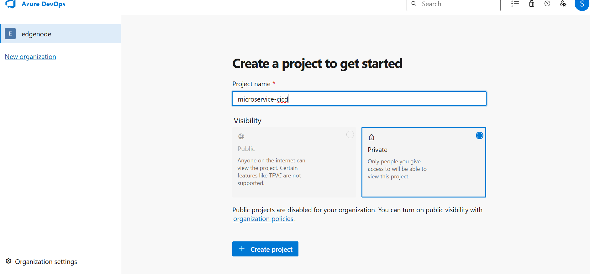
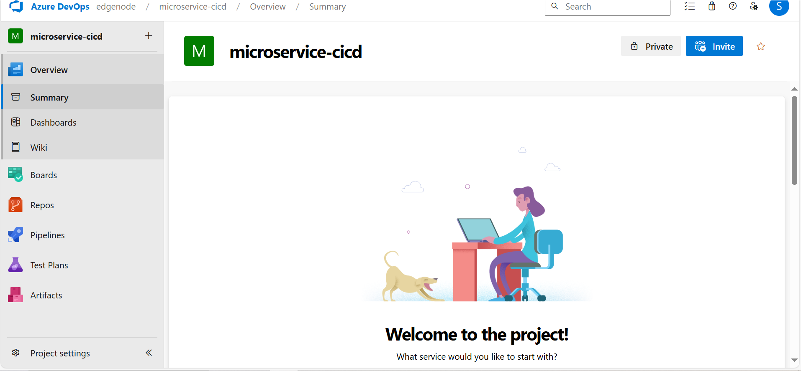
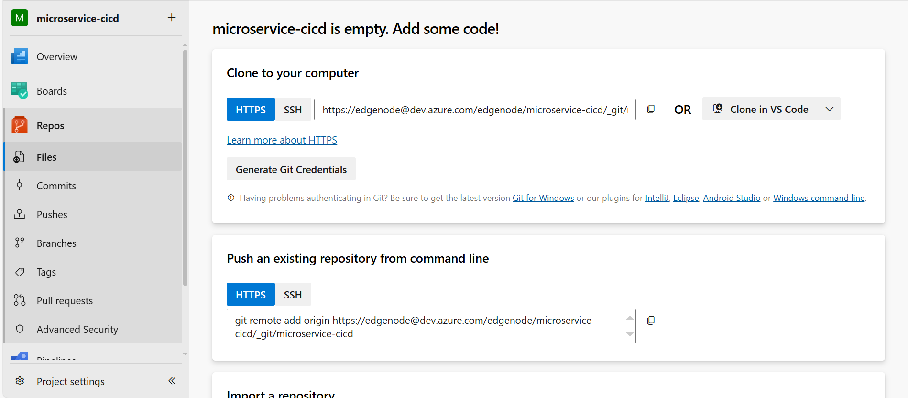
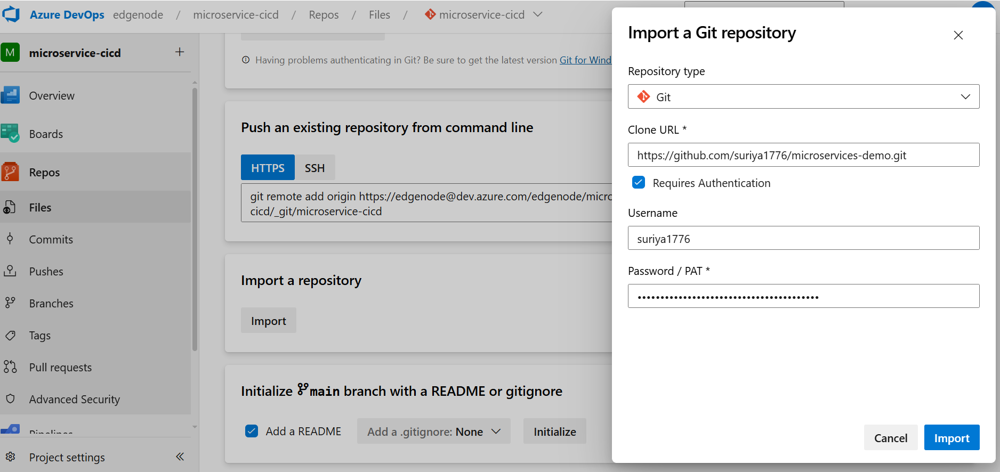
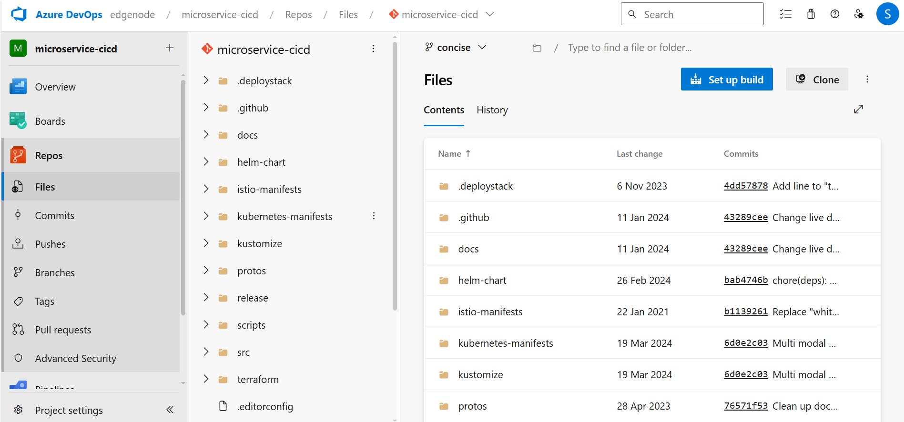

# Creating a repo in azure devops

- Create a organization , logging into https://go.microsoft.com/fwlink/?LinkId=307137

- Create a project, enter the project name and check the visibility as private, click on create project

- Click on repos, Based on your requirement , choose the way to initialize your repo, since I already have a repo maintained in github, I am going to import the repo

