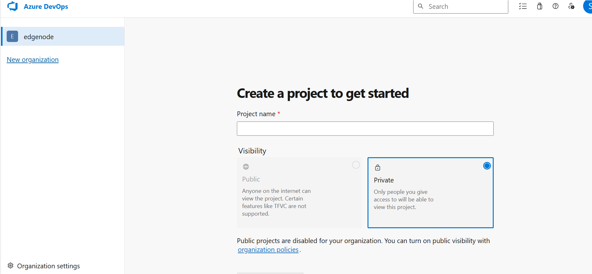
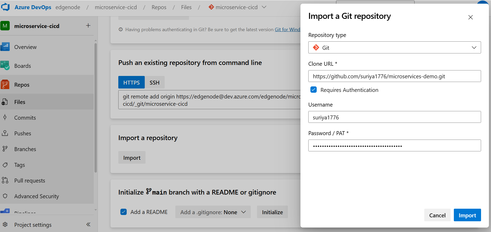

# 🚀 **Creating a Repository in Azure DevOps**

Setting up a repository in Azure DevOps is the first step in building your DevOps pipeline. Follow these steps to create and initialize your repo efficiently.

## 🢠**Step 1: Create an Organization**

To begin, log in to Azure DevOps and create an organization:

🔗 **[Azure DevOps Login](https://go.microsoft.com/fwlink/?LinkId=307137)**

📌 **Go to the Azure DevOps portal and sign in with your credentials.**  
📌 **Click on 'Create Organization' and follow the on-screen instructions.**

---

## 📂 **Step 2: Create a Project**

Once the organization is set up, create a new project:

📌 **Click on 'New Project'.**  
📌 **Enter a project name.**  
📌 **Set visibility to 'Private'.**  
📌 **Click 'Create Project'.**

After successful creation, you'll see the project dashboard:

---

## 🔗 **Step 3: Set Up Azure Repos**

Now, navigate to the Repos section to initialize your repository:

📌 **Click on 'Repos' in the left sidebar.**  
📌 **Choose the desired method to initialize your repo.**  
📌 **If you already have a repository on GitHub, you can import it instead of creating a new one.**

