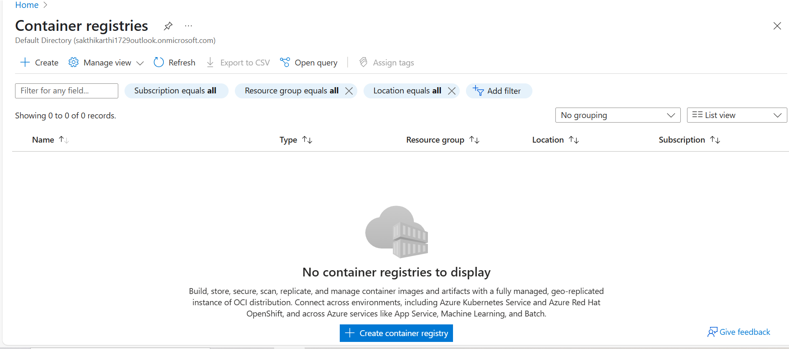
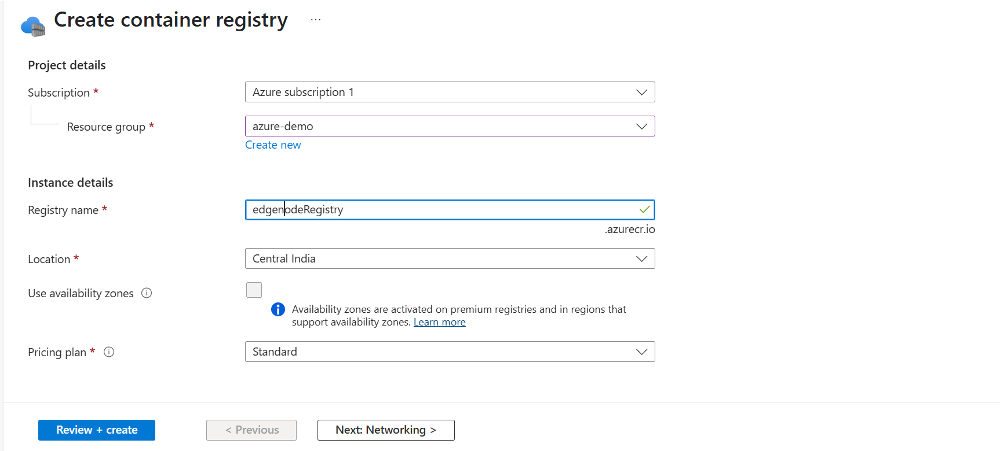
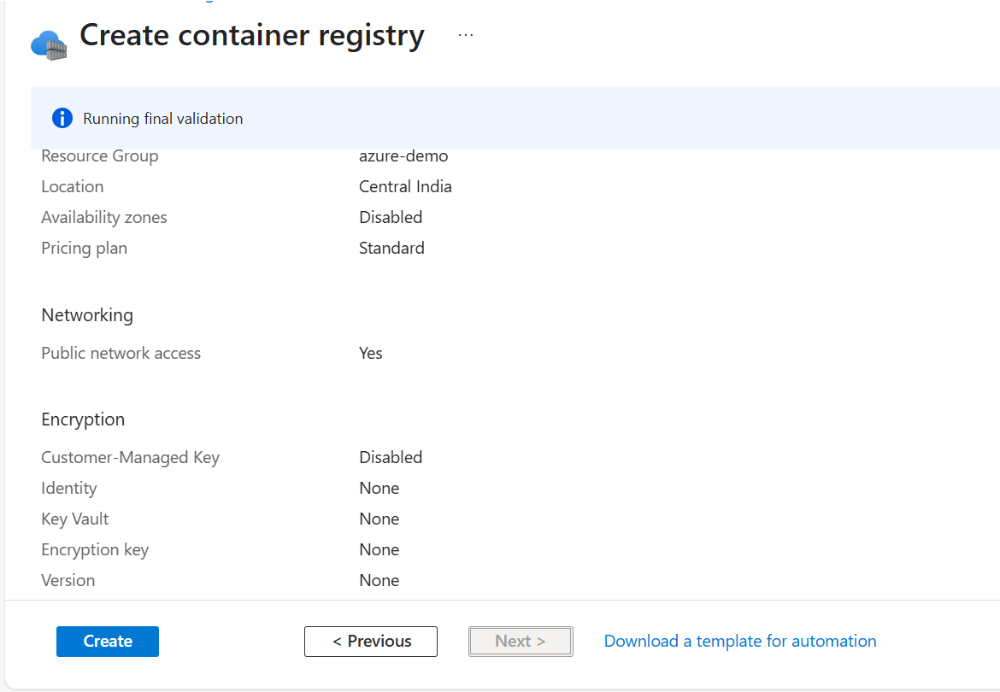

# 🛠 **Configuring Azure Container Registry for Your Project**

Setting up an **Azure Container Registry (ACR)** allows you to store and manage container images efficiently. Follow these steps to configure ACR for your project.

---

## 🔍 **Step 1: Search for Container Registry**

📌 **Log in to the [Azure Portal](https://portal.azure.com/).**  
📌 **In the search bar, type "Container Registry" and select it from the results.**

---

## 🏗 **Step 2: Create a New Container Registry**

📌 **Click on "Create Container Registry".**  
📌 **Enter a unique registry name.**  
📌 **Select an existing Resource Group or create a new one.**  
📌 **Click "Review + Create" to proceed.**

---

## 🚀 **Step 3: Finalizing the Registry Creation**

📌 **Review all details carefully.**  
📌 **Click "Create" to deploy your Azure Container Registry.**

Once the deployment is complete, your ACR is ready for use.

