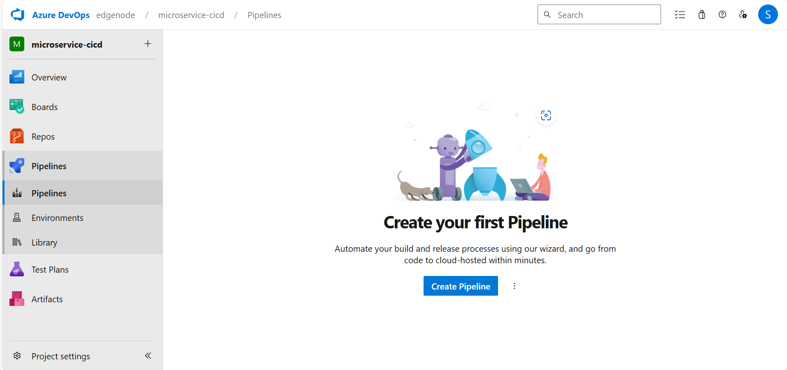
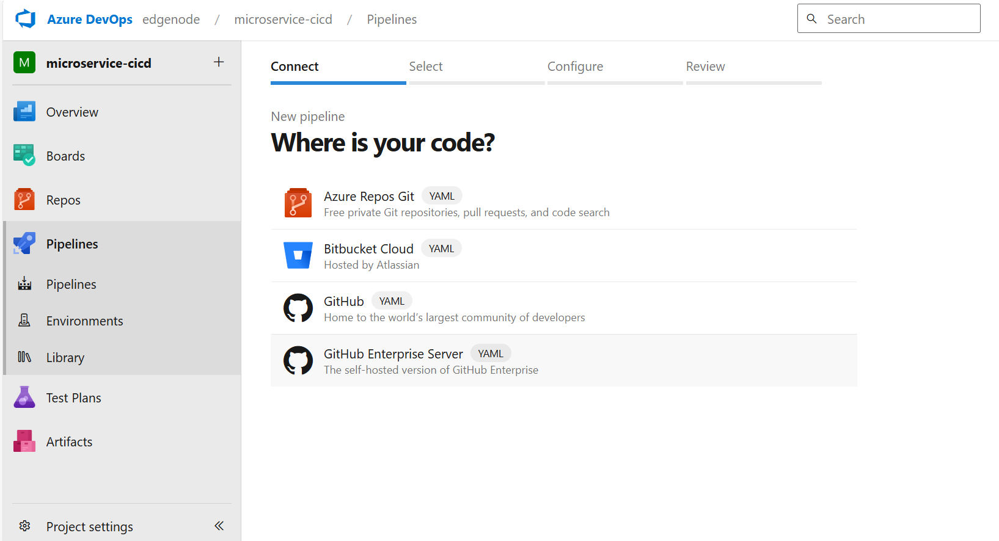
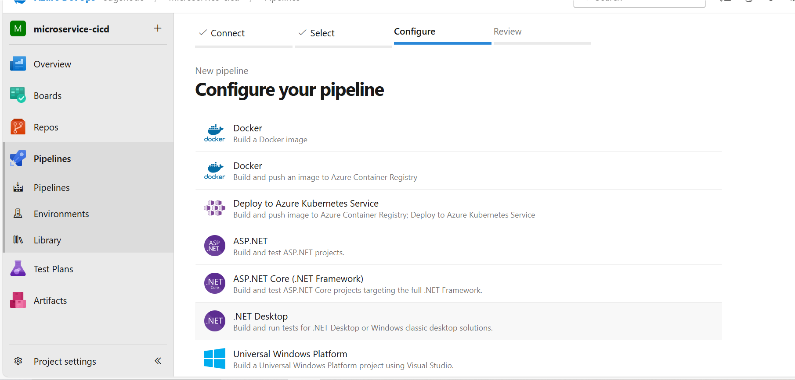
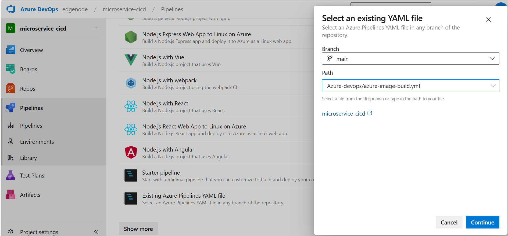
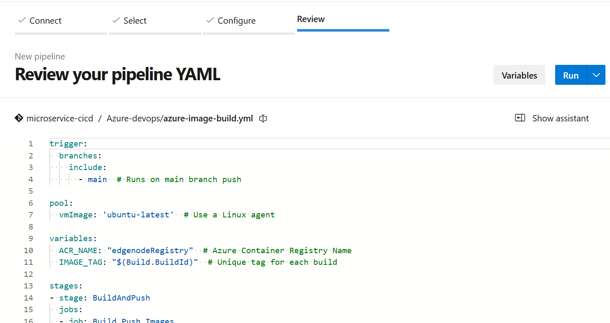
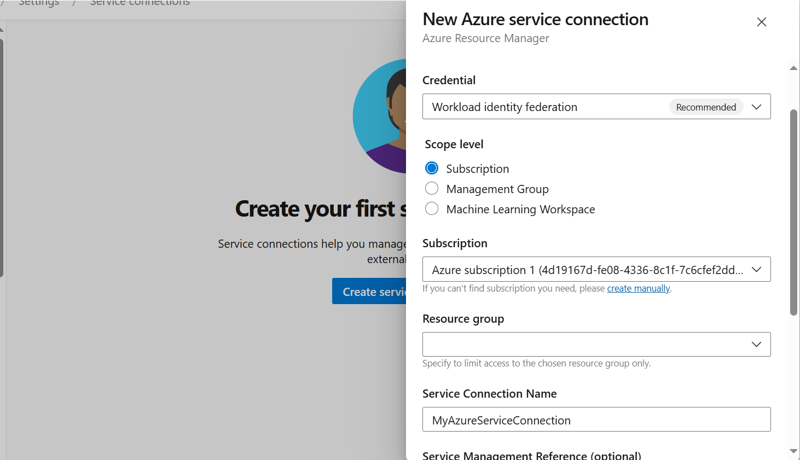

# ⚙️ **Configuring an Azure Pipeline**

Setting up an **Azure Pipeline** automates the process of building and deploying your application. Follow these steps to configure your pipeline efficiently.

---

## 🚀 **Step 1: Create a New Pipeline**

📌 **Go to the Azure DevOps homepage.**  
📌 **Click on "Pipelines" from the left navigation menu.**  
📌 **Click on "Create Pipeline".**  
📌 **You can create separate pipelines for image building and deployment in an AKS cluster.**

---

## 🔗 **Step 2: Create a Service Connection**

To allow **Azure Pipelines** to interact with your **Azure Container Registry (ACR)** and **other Azure services**, create a service connection:

📌 **Navigate to "Project Settings" in Azure DevOps.**  
📌 **Click on "Service connections" under the "Pipelines" section.**  
📌 **Select "Azure Resource Manager" and choose "Service Principal (automatic)".**  
📌 **Provide the necessary details and authorize the connection.**

