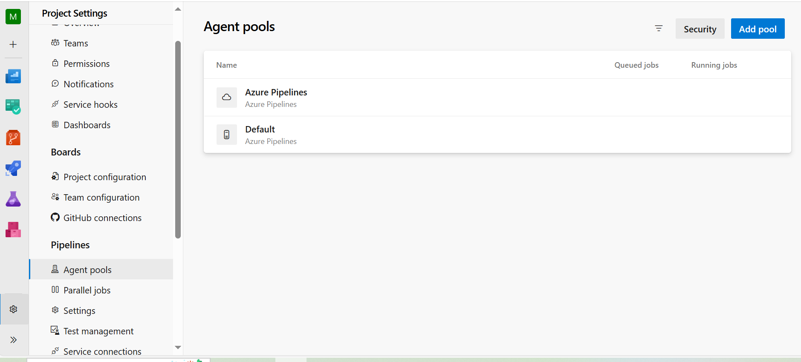
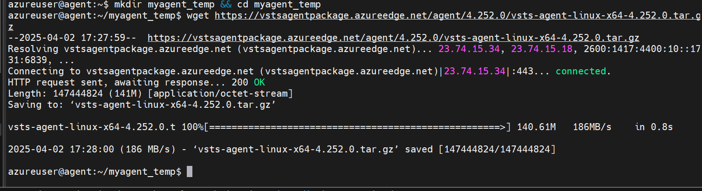

# Linking a local agent with pipeline

- Click on project settings in bottom left corner ,  go to agent pools and create a agent under default



- Click on new agent , follow the steps based on you local machine's operating system 

```bash
mkdir myagent_temp && cd myagent_temp
```

- Download the agent with wget in the folder created



- Extract the agent tar and run ./config.sh , this will check if machine suits to be connected to the azure pipeline, and some configuration steps to be followed

- You need a personal access token , with agent pool(read and write premission) to configure the agent

- And execute ./run.sh to connect agent and azure pipeline


