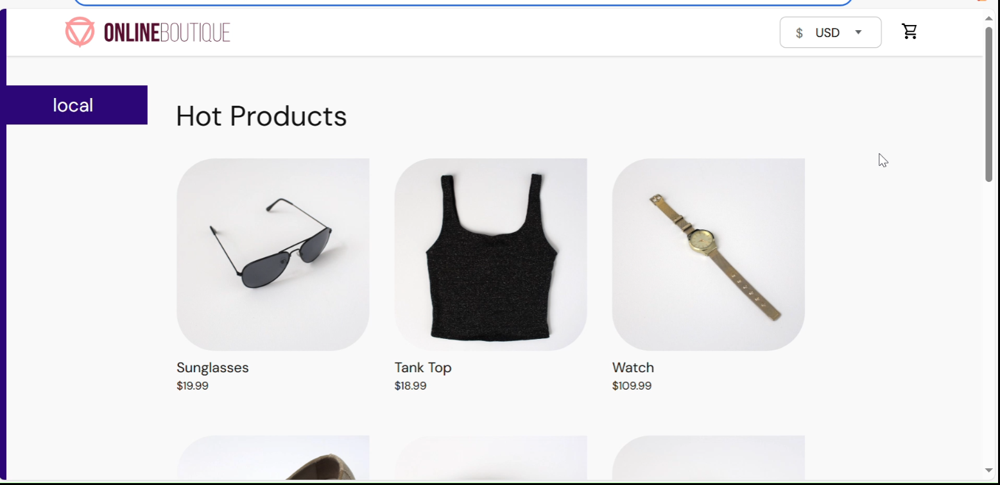
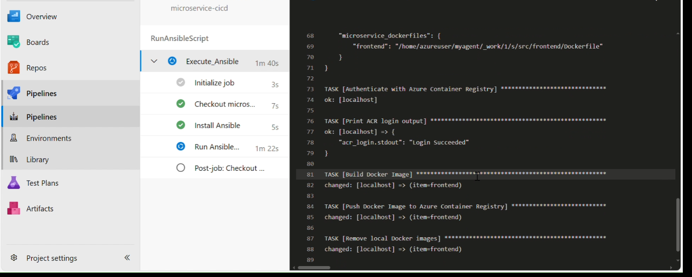
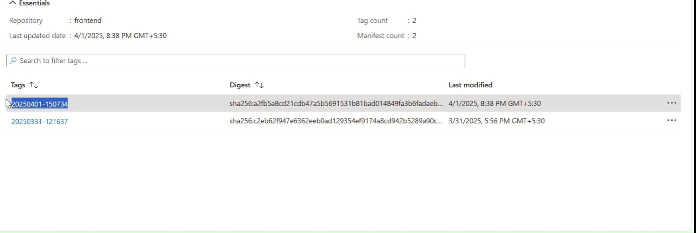
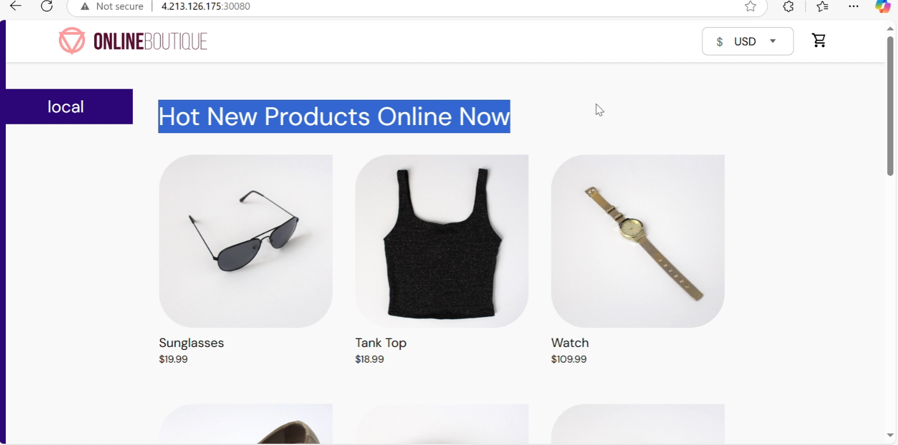

# Build and deploy demo

- This is the application running in aks cluster , I am going to change the heading from "Hot products" to "Hot new products online"

- Changes are done and commited 

- Pipeline is successfully executed

- New image is pushed to registry

- Once Image is pushed , deloy pipeline is triggered and Image tag is changed only to the respective deployment , rest remains the same

