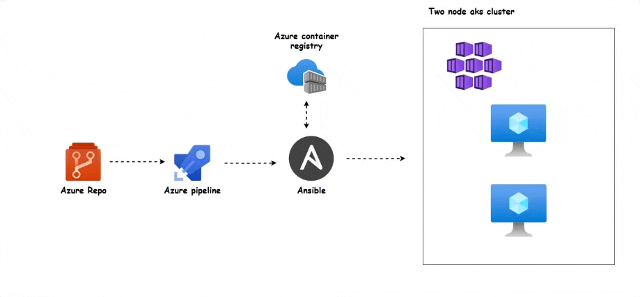

# 🚀 **End-to-End DevOps Pipeline with Azure AKS & Ansible**

## 🏗 **Project Overview**

This project demonstrates a complete DevOps pipeline for deploying containerized applications to an Azure Kubernetes Service (AKS) cluster using Azure DevOps, Ansible, and Azure Container Registry. The process automates building, packaging, and deploying applications seamlessly. 💡

### 🌍 **Tech Stack Used**

- **Azure DevOps** 🏗️ – Source code management & CI/CD automation
    
- **Azure Container Registry (ACR)** 📦 – Container storage & management
    
- **Azure Kubernetes Service (AKS)** ☁️ – Managed Kubernetes cluster
    
- **Ansible** ⚙️ – Configuration management & deployment automation
    

## 📌 **Architecture Overview**

## 🛠 **Project Steps**

Each step in this process is designed to ensure a smooth and automated deployment pipeline. Below is an overview of the steps involved:

### **🔹 Step 1 - Creating a Repo in Azure DevOps**

📌 Set up a new repository in **Azure DevOps** to store your project’s source code and configuration files. This repo will serve as the foundation for your CI/CD pipeline.  
[👉Read more](01.md)

### **🔹 Step 2 - Configuring Azure Container Registry (ACR)**

📌 Set up **Azure Container Registry (ACR)** to manage and store Docker container images. This allows efficient image versioning and security enforcement.  
[👉Read more](02.md)

### **🔹 Step 3 - Configuring an Azure Pipeline**

📌 Define an **Azure DevOps Pipeline** to automate the build and deployment process. This includes setting up YAML configurations for continuous integration and delivery.  
[👉Read more](03.md)

### **🔹 Step 4 - Linking a Local Agent with the Pipeline**

📌 Set up a **self-hosted agent** to execute the pipeline jobs on your local or cloud machine. This improves performance and security in the CI/CD process.  
[👉Read more](04.md)

### **🔹 Step 5 - Build and Deploy Demo**

📌 Run the complete pipeline to build, push, and deploy the application to **Azure Kubernetes Service (AKS)** using **Ansible**. Monitor the deployment and verify the application in the cluster.  
[👉Read more](05.md)
    

## 🎯 **Key Features**

✅ Automated build & deployment pipeline ✅ Scalable Kubernetes infrastructure ✅ Secure container registry for image storage ✅ Seamless CI/CD integration with Azure DevOps ✅ Configuration management using Ansible

---

This setup ensures a streamlined DevOps workflow for deploying modern cloud-native applications. Happy coding! 🚀💙