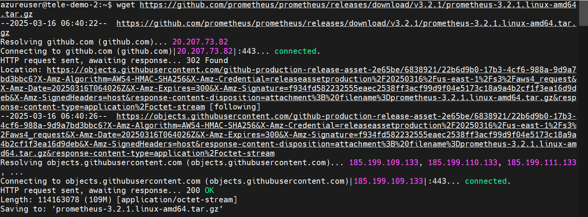
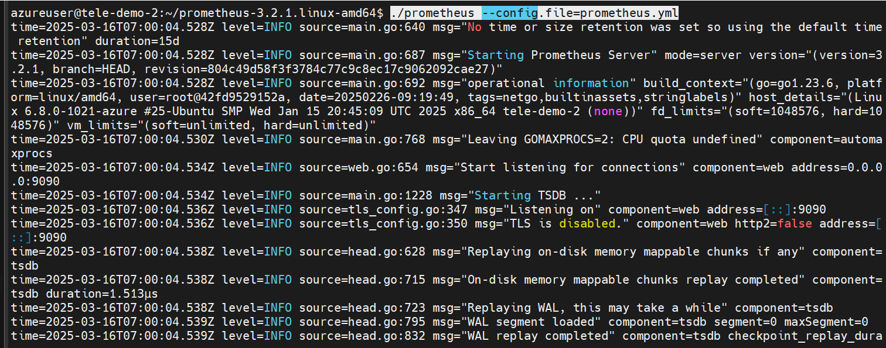
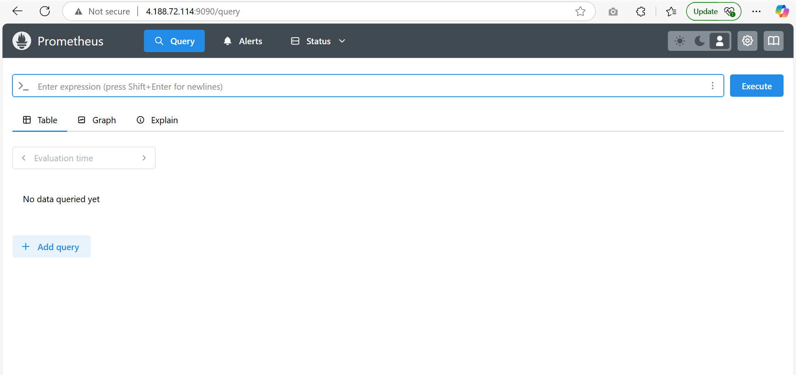
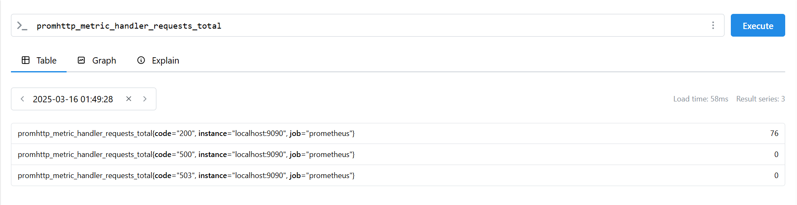
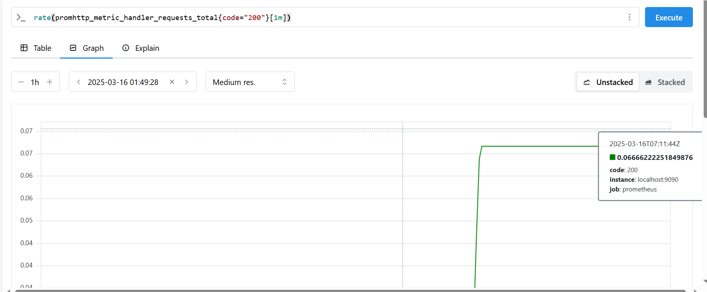

# Installing prometheus in machine

- Extract the latest installer for your respective OS from the official release page

```sh
https://prometheus.io/download/
```



- Extract the installer

```sh
tar -xvzf prometheus-3.2.1.linux-amd64.tar.gz
```

- Verify the installation

```sh
./prometheus --help
```

- The prometheus.yml present in the home directory of installer is used for launching the default server

> global:
>   scrape_interval:     15s
>   evaluation_interval: 15s
> 
> rule_files:
>   //commented - "first.rules"
>   //commented - "second.rules"
> 
> scrape_configs:
>   - job_name: prometheus
>     static_configs:
>       - targets: ['localhost:9090']

- The scrape intervals is 15s for every 15s metrics will be scraped, In scrape config it is mentioned to scrape from prometheus itself which is hosted in 9090

## Start prometheus

```sh
./prometheus --config.file=prometheus.yml
```



- Login from the browser in 9090 port



## Using the expression browser

- Through quering we can get the metrics, one metric that Prometheus exports about itself is called promhttp_metric_handler_requests_total



## Using the graph

- For example, enter the following expression to graph the per-second HTTP request rate returning status code 200 happening in the self-scraped Prometheus

```sh
rate(promhttp_metric_handler_requests_total{code="200"}[1m])
```


