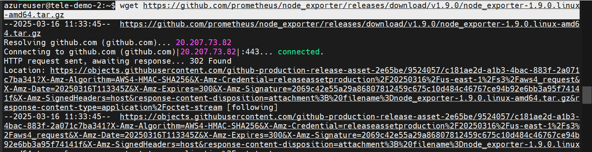
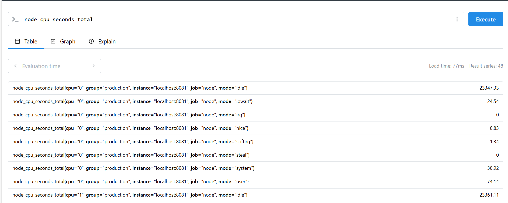
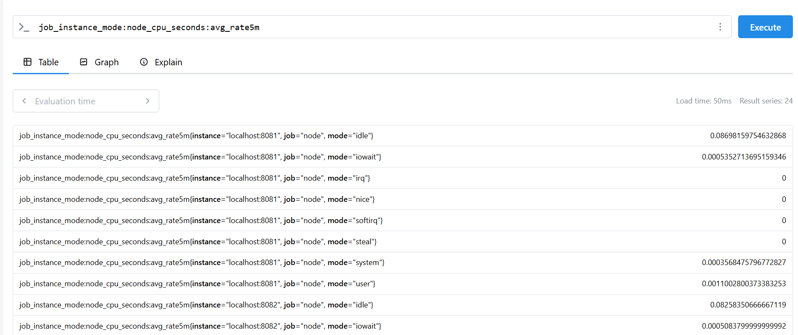

# Node Exporter and rules

## Installing node exporter

- Download the binary from downloads page

```sh
https://prometheus.io/download/
```

- Extract the binaries

```sh
 wget https://github.com/prometheus/node_exporter/releases/download/v1.9.0/node_exporter-1.9.0.linux-amd64.tar.gz
 tar -xvzf node_exporter-1.9.0.linux-amd64.tar.gz
```



```sh
cd node_exporter-1.9.0.linux-amd64
```

- Let's start node explorer in three nodes
- Node exporter provides the hardware and machine informations

```sh
./node_exporter --web.listen-address 127.0.0.1:8081
./node_exporter --web.listen-address 127.0.0.1:8082
./node_exporter --web.listen-address 127.0.0.1:8083
```



## Recording rule

- When you query the average on the fly, Prometheus has to scan all the raw time series data, compute the rate, and then aggregate it. This takes more time and resources, especially if you have thousands of time series.
- By defining a recording rule, Prometheus precomputes the result and stores it as a new time series when it runs. So when you query it later, Prometheus retrieves the already computed values instead of processing everything from scratch. This reduces query time significantly and improves performance.


- Create a file for defining the rules "prometheus.rules.yml"


```yaml
groups:
- name: cpu-node
  rules:
  - record: job_instance_mode:node_cpu_seconds:avg_rate5m
    expr: avg by (job, instance, mode) (rate(node_cpu_seconds_total[5m]))
```

- Here the expression is take cpu per seconds and average the timinings

- Add the rules in the main yaml

```yaml
global:
  scrape_interval:     15s # By default, scrape targets every 15 seconds.
  evaluation_interval: 15s # Evaluate rules every 15 seconds.
# Attach these extra labels to all timeseries collected by this Prometheus instance.
  external_labels:
    monitor: 'codelab-monitor'
rule_files:
  - 'prometheus.rules.yml'
scrape_configs:
  - job_name: 'prometheus'
```

- When the prometheus started with the about main yaml ,the rules file is processed and expression is made and assigned to record

- When we query the record in the UI , the result expression is displayed


