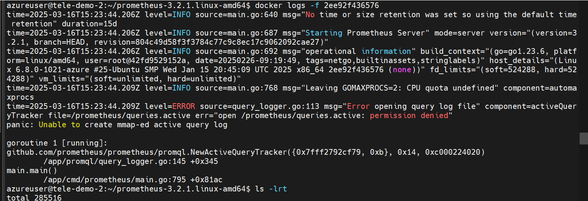
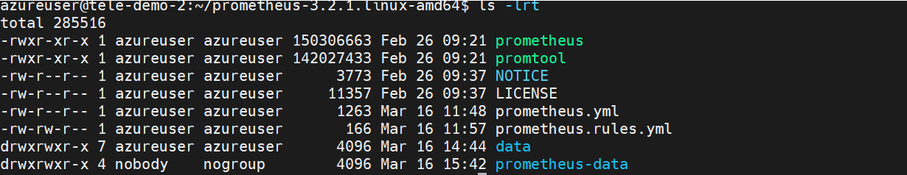

# Installing prometheus using docker

## Starting container with custom prometheus.yml

- Have the file in the host machine and execute the command where the file is present

```sh
docker run  -d   -p 9090:9090     -v $(pwd)/prometheus.yml:/etc/prometheus/prometheus.yml     prom/prometheus
```

- prometheus is deployed in container and exposed in port 9090, we can access the application from browser

## prometheus data presistance

- we can mount the prometheus container data to the host machine , so that even when we exit the container and restart the container the data will persist

### Issues faced

- The container will have a specific user id and group id , the directory created in host machine should also have the same uid and gid , if not the container will not have permissions to write the data to host machine 
- When I started the container with necessary premissions



- Find the uid and gid of the Image , by running below command

```sh
docker exec -it ffbdf7f1a65e id
output - uid=65534(nobody) gid=65534(nobody) groups=65534(nobody)
```

- Based on the info recevied , make the directory in host machine with same uid and gid

```sh
sudo chown -R 65534:65534 prometheus-data
sudo chmod -R 775 prometheus-data
```



- Now start the container with below command

```sh
docker run -d -p 9090:9090  -v $(pwd)/prometheus.yml:/etc/prometheus/prometheus.yml -v $(pwd)/prometheus-data:/prometheus prom/prometheus
```

