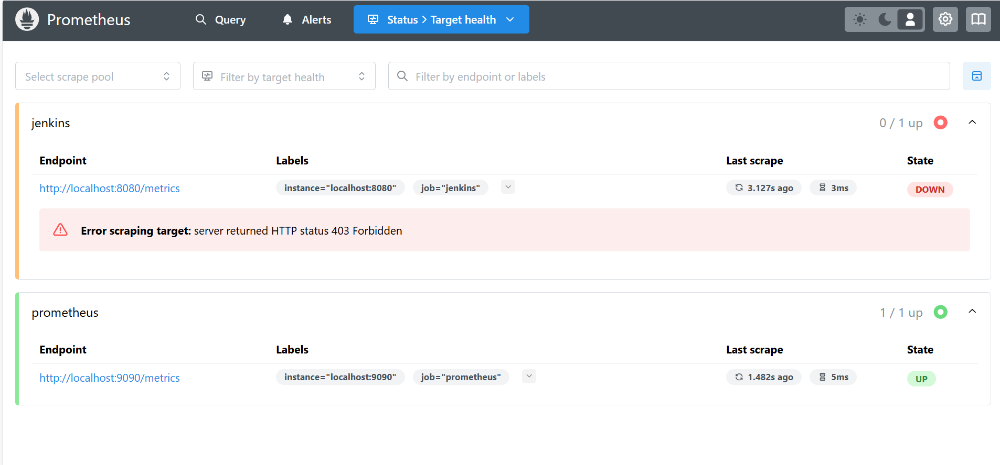

# Config reload in runtime

- configuration file can be updated and it can be loaded without restarting the application

- To enable the feature start prometheus with flag --web.enable-lifecycle

```sh
./prometheus --config.file=prometheus.yml --web.enable-lifecycle
```

- My scrape config have config to scrape prometheus itself

```yaml
# Here it's Prometheus itself.
scrape_configs:
  # The job name is added as a label `job=<job_name>` to any timeseries scraped from this config.
  - job_name: "prometheus"

    # metrics_path defaults to '/metrics'
    # scheme defaults to 'http'.

    static_configs:
      - targets: ["localhost:9090"]
```

## Reloading the config

- Updating the scrape config with another entry , my case I have a jenkins container running in the instance 

```yaml
scrape_configs:
  # The job name is added as a label `job=<job_name>` to any timeseries scraped from this config.
  - job_name: "prometheus"

    # metrics_path defaults to '/metrics'
    # scheme defaults to 'http'.

    static_configs:
      - targets: ["localhost:9090"]

  - job_name: "jenkins"

    # metrics_path defaults to '/metrics'
    # scheme defaults to 'http'.

    static_configs:
      - targets: ["localhost:8080"]
```

- we can trigger the reload by SIGHUP and reload command, I am using SIGHUP command

- Identify the pid of prometheus , and kill it with SIGHUP

```sh
kill -SIGHUP <pid of prometheus>
```

- Immediately after the kill command , configuration is reloaded and logs show the configuration reload

```sh
time=2025-03-19T14:34:34.328Z level=INFO source=main.go:1437 msg="Loading configuration file" filename=prometheus.yml
time=2025-03-19T14:34:34.336Z level=INFO source=main.go:1486 msg="Completed loading of configuration file" db_storage=1.603µs remote_storage=2.254µs web_handler=615ns query_engine=2.24µs scrape=7.34967ms scrape_sd=50.992µs notify=259.364µs notify_sd=7.383µs rules=1.461µs tracing=5.325µs filename=prometheus.yml totalDuration=8.273782ms
```



- The service is listed in the UI
